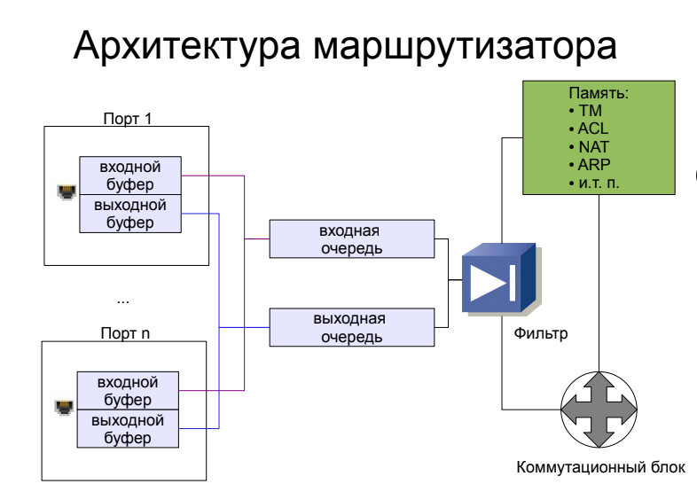
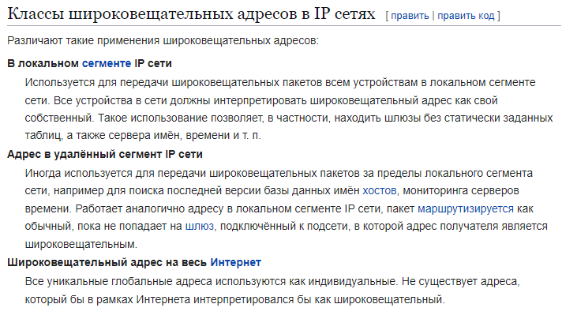
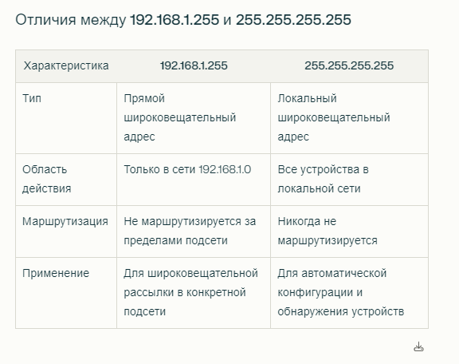

# IP, белые, серые. Маска, CIDR. Сетевой интерфейс. Мак адрес, ARP протокол. Хаб, коммутатор, маршрутизатор. Широковещательный IP, адрес подсети. TTL, Зарезервированные IP-адреса.

## IP, белые, серые. Маска, CIDR.

**IP** - протокол сетевого уровня стека TCP/IP. Согласно ему, у любого узла сети есть IP-адрес -> возможна пересылка межу любыми пакетами.

Пересылка в глобальной сети (между сетями) выполняется через маршрутизатор на сетевом уровне, а в локальном сегменте на канальном уровне по физическому адресу.

**IP-адрес** - 32-разрядное двоичное число, разделенное на группы по 8 бит, называемых _октетами_.

**IP-адрес** - уникальный адрес для обозначения устройств, служащий для индентификации устройства в сети и общения с другими устройствами в сети.

**Белые IP-адреса** - глобальные, публичные - уникальны во всем Интернете и могут быть доступны извне. 

**Серые IP-адреса** - локальные - используются внутри локальных сетей. Не маршрутизируются напрямую через Интернет и не доступны извне локальных сетей. Предназначены для внутреннего использования и обеспечивают уникальныую идентификацию каждого устройства внутри этой сети.

Классы IP-адресов:

К частным адресам относятся адреса из подсетей:
* 10.0.0.0/8 - 10.255.255.255/8
* 172.16.0.0/12 - 172.31.255.255/12
* 192.168.0.0/16 - 192.168.255.255/16

Сетевые устройства логически объединяются в подсети. Каждому сетевому устройству назначаются IP-адрес и маска подсети.

**Маска** - число, которое используется в паре с IP-адресом. Двоичная запись маски содержит единицы в тех разрядах, которые должны стоять в IP-адресе интерпретироваться как номер сети.
* разрывы в последовательности единиц или нулей недопустимы -> сначала 111111... потом ...00000

**CIDR** - Classes Inter-Domain Routing - нотация, предназначенная для представления группы или диапазона IP-адресов (типа для представления подсети).
* IP-адрес + длина префикса, разделенные косой чертой.
* 192.168.0.15 с маской 255.255.255.0 -> 192.168.0.15/24

Маски стандартных классов сетей:
* А - 255.0.0.0 (8)
* В - 255.255.0.0 (16)
* С - 255.255.255.0 (24)

Правило определения общего количества узлов (или подсетей):
* N - число разрядов для представления номера узла
* 2^N - 2 = общее количество
* вычитаем все 00 и все 11. Они в специальных целях используются

#### IPv4 и IPv6
Это поколения интернет-протокола.

IPv4
* самый распространенный
* 32-битный IP-адрес у компа
* 4 миллиарда адресов -> уже не хватает

IPv6
* 128-битный IP (8 групп шестнадцетеричных чисел, разделенных двоеточиями)
* очень очень очень сильно больше адресов -> у каждого может быть сотни миллионов устройств с адресами

## Сетевой интерфейс.

**Сетевой интерфейс** - точка подключения двух частей сетевого оборудования или уровней протокола.
* это часть аппаратного устройства, которая позволяет операционным системам и программам передавать данные через компьютерную сеть.
* Он является частью сетевой карты, маршрутизатора, коммутатора и других устройств.
* Он обеспечивает связь между устройствами и сетями.
* Отвечает за инкапсуляциюданных в пакеты и их передачу по сети. При этом данные разбиваются на части и добавляются заголовки протоколов для корректной доставки.

Есть интерфейсы:
* физические (Ethernet-карты, Wi-Fi адаптеры, которые обеспечивают физическое подключение к сети)
* виртуальные (создаются программно и могут использоваться для передачи данных между приложениями или для организации виртуальных частных сетей). Пример - интерфейс lo (loopback), он для связи внутри одного устройства.

Сетевые интерфейсы могут интерпретироваться различными образами:
* MAC-адрес - уникальный аппаратный адрес, присвоенный каждому сетевому устройству.
* IP-адрес 
* Имена адаптеров (eth0 и тд)

Параметры сетевых интерфейсов:
* Сетевой адрес
* Маска подсети
* Широковещательный адрес
* MTU (Maximum Transmission Unit) - максимальный размер пакета данных

**Ethernet** - технология, которая обеспечивает передачу данных в локальных сетях.
* использует архитектуру, основанную на методе доступа с разделением среды. То есть данные не всем устройствам в сети передаем, а направляем кадры только к конкретным адресатам -> повышение скорости и безопасности сети.
* охватывает физический уровень (уровень 1) и канальный уровень (уровень 2) модели OSI. 

##  Мак адрес, ARP протокол.

**MAC-адрес** - Media Access Control Address - уникальный идентификатор, присваиваемый каждому сетевому устройству, который используется для его идентификации в сети. 
* Это физический адрес сетевого устройства (в сетях Ethernet).
* 6 байт
* обычно представляется в шестнадцатеричном формате, разделенном доеточиями или дефисами
* 00:1C:BF:0C:81:2B, например
* первые 24 бита - производитель устройства
* последние 24 бита - уникальный идентификатор устройства - назначаются производителем, обеспечивая уникальность адреса в пределах его продукции

**ARP протокол** - протокол, предназначенный для определения MAC-адреса другого компьютера по известному IP-адресу.
1. устройство отправляет ARP-запрос на широковещательный MAC-адрес
2. все устройства в сети получают этот запрос
3. устройство, чей IP-адрес совпадает с указанным в запросе, отправляет ARP-ответ, содержащий свой MAC-адрес
4. устройство-отправитель запроса получает ответ, извлекает из него MAC-адрес и сохраняет в свою ARP-таблицу (ARP кэш???), чтобы использовать его для дальнейшей передачи данных на канальном уровне

**ARP-кэш** - таблица отображения
* IP, MAC, тип записи (статическая или динамическая)
* Динамическая запись - занесена в таблицу путем широковещательного ARP-запроса. время устаревания есть (обычно 180 или 360 с). После устаревания удаляются из таблицы
* Статическая запись - занесена вручную. Не устаревает

## Хаб, коммутатор, маршрутизатор.

### Коммутатор (свитч)

Оперируют на канальном уровне (уровень 2 модели OSI) и предоставляют более сложные функции по сравнению с хабами. 

Коммутатор анализирует MAC-адреса устройств и направляет данные только к нужному получателю. Он создает таблицу MAC-адресов, что позволяет ему знать, какой адрес подключен к какому порту.

Коммутатор хранит в памяти (ассоциативной памяти) таблицу коммутации, в которой указывается соответствие MAC-адреса узла порту коммутатора.

При включении коммутатора эта таблица пуста, и он работает в режиме обучения. В этом режиме поступающие на какой-либо порт данные передаются на все остальные порты коммутатора.

Коммутатор анализирует фреймы (кадры) и, определив MAC-адрес хоста-отправителя, заносит его в таблицу на некоторое время.

Если на один из портов коммутатора поступит кадр, предназначенный для хоста, MAC-адрес которого уже есть в таблице, то этот кадр будет передан только через порт, указанный в таблице.

Если MAC-адрес хоста-получателя не ассоциирован с каким-либо портом коммутатора, то кадр будет отправлен на все порты, за исключением того порта, с которого он был получен.

Со временем коммутатор строит таблицу для всех активных MAC-адресов, в результате чего трафик локализуется.

Они позволяют 
* подключаться к нескольким устройствам
* управлять портами
* регулировать настройки безопасности VLAN

Преимущества:
* эффективная передача данных -> анализируют MAC-адрес устройств и направляют информацию только к нужному получателю -> снижает нагруженность сети и повышает производительность
* управление трафиком -> можно фильтровать трафик
* поддержка виртуальных локальных сетей VLAN -> улучшает безопасность и гибкость конфигурации сети
* высокая пропускная способность 

В небольших локальных сетях с ограниченным числом устройств коммутаторы могут оказаться избыточными. Их продвинутые функции управления трафиком и фильтрации данных могут быть излишними, что ведет к избыточным расходам.

### Маршрутизатор (роутер)

**Маршрутизатор** или роутер, рутер (от англ. router) — узел сети, на основании информации о топологии сети и определённых правил принимающий решения о пересылке пакетов сетевого уровня (уровень 3 в модели OSI) между различными сегментами сети.

Маршрутизатор использует адрес получателя, указанный в пакетах данных, и определяет по таблице маршрутизации путь, по которому следует передать данные. Если в таблице маршрутизации для адреса нет описанного маршрута, пакет отбрасывается.

Принцип работы роутера:
1. Пользователь отправляет запрос.
2. Адаптер беспроводной сети, который находится внутри его устройства, формирует пакет информации и кодирует его, преображает в радиосигнал.
3. Если сигнал находится в зоне покрытия сети, он добирается до антенн роутера.
4. Маршрутизатор принимает сигнал через антенны и расшифровывает его обратно.
5. Роутер сверяет адреса по таблице маршрутизации и отправляет пакет с информацией сайту-получателю.
6. Получатель принимает запрос.

Таблица маршрутизации представляет из себя особую структуру данных, обычно зависящую от конкретного стека протоколов и/или типа (модели) маршрутизатора.

Действуют на сетевом уровне (уровень 3) и способны направлять данные в сети.

Он использует IP-адреса для определения назначения пакетов данных и принимает решения о том, куда их отправить. Маршрутизаторы могут связывать локальные сети с интернетом или другими сетями.

Они:
* способны принимать решения о маршрутизации на основе IP-адресов

Преимущества:
* маршрутизация данных между сетями -> основное предназначение -> в отличие от хабов и коммутаторов, маршрутизаторы поднимают передачу данных на новый уровень, позволяя эффективно связывать подсети
* обеспечение безопасности сети -> есть встроенные средства безопасности, фильтрации трафика и настройки правил. Они способны контролировать доступ к ресурсам
* подключение к интернету -> то есть они способны обеспечить доступ к внешним ресурсам. Есть возможность взаимодействия не только внутри сети, но и с глобальной сетью
* управление трафиком -> установка приоритетов, оптимизация маршрутов, гибкое управление потоком данных

Маршрутизаторы обладают более сложной конфигурацией по сравнению с хабами и даже коммутаторами. Это может создавать трудности при первоначальной настройке, особенно для тех, кто не знаком с сетевыми технологиями.

Ограниченная пропускная способность внутренней шины:
* Внутренняя шина маршрутизатора может стать узким местом в условиях высокой интенсивности трафика. Это ограничение может влиять на общую производительность сети.

### Хаб (концентратор)

**Хабы** функционируют на физическом уровне (уровень 1 модели OSI) и служат своеобразным центральным узлом для объединения персональных компьютеров в сеть.

Когда данные приходят на один из портов хаба, он копирует их и рассылает на все остальные порты. Это означает, что все устройства в сети получают данные, независимо от того, предназначены ли они для них.

Он просто повторяет входящие сигналы на все свои порты, не анализируя их содержимое. Это означает, что все данные, поступающие на один порт, отправляются на все остальные порты.

Преимущества:
* простота и надежность -> передает данные от одного устройства ко всем остальным в сети, без какой-либо интеллектуальной фильтрации
* бюджетное решение -> более доступные по цене
* простота в сети -> Если у вас небольшая локальная сеть с ограниченным числом устройств и минимальным трафиком, хаб может быть идеальным решением
* применение в ограниченных условиях -> В ограниченных условиях, когда нет высоких требований к производительности или безопасности, хаб может выполнять свою задачу передачи данных в пределах локальной сети

Одним из основных ограничений хабов является их ограниченная пропускная способность. Поскольку хаб передает данные всем устройствам в сети, происходит конкуренция за доступ к линии, что может привести к снижению производительности.

Хабы лишены интеллектуальной фильтрации трафика, и они не способны управлять потоком данных. Это может сделать их неэффективными в сетях с высоким уровнем трафика и требованиями к управлению данными.

## Широковещательный IP, адрес подсети. 

**Широковещательный IP** - условный адрес, который используется для передачи широковещательных пакетов в компьютерных сетях.
* это специальный адрес, который используется для отправки данных всем устройствам в определенной подсети одновременно. Он позволяет передавать сообщения, не указывая конкретного получателя, что делает его полезным для различных сетевых протоколов.

В зависимости от модели OSI различают несколько видов широковещательных адресов:
* на L2 используется широковещательный MAC-адрес FF:FF:FF:FF:FF:FF
* на L3 используются широковещательные адреса, вид которых зависит от протокола.

Широковещательные адреса формируются следующим образом в IP-сетях:
* к адресу подсети прибавляется побитовая инверсия маски подсети
* Например, адрес сети 192.168.0.0, маска 255.255.255.0 -> широковещательный адрес 192.168.0.255

Применение (от перплексити):
* Обнаружения устройств в сети (например, ARP-запросы).
* Получения информации от всех хостов (например, запросы на получение DHCP)

### (есть еще такое)

#### Как я поняла!!!
192.168.1.255 - directed broadcast - прямой широковещательный адрес в сети 192.168.1.0/24
* Этот адрес используется для отправки широковещательных сообщений всем устройствам в конкретной подсети, в данном случае — в сети 192.168.1.0/24
* Когда пакет отправляется на адрес 192.168.1.255, все устройства в подсети 192.168.1.0 принимают этот пакет
* Пакеты, отправленные на этот адрес, не маршрутизируются за пределы подсети 192.168.1.0.

255.255.255.255 - limited broadcast - локальный широковещательный адрес
* Этот адрес используется для отправки сообщений всем устройствам в локальной сети без указания конкретного адреса сети.
* Пакеты, отправленные на адрес 255.255.255.255, принимаются всеми устройствами в локальной сети, и они не маршрутизируются за её пределы.
* Этот адрес используется, когда устройство не знает о своей сети, например, при запросе DHCP.

Это перплексити на мой вопрос отвечает!!!!
* Прямой широковещательный -> Такие пакеты могут быть маршрутизированы, но по умолчанию маршрутизаторы не пересылают их из соображений безопасности и предотвращения избыточного трафика. Типа из 192.168.2.0/24 в 192.168.1.0/24
* Локальный широковещательный -> Пакеты, отправленные на этот адрес, никогда не маршрутизируются за пределы локальной сети, что делает его ограниченным только для текущей подсети. Тут типа всегда не выходят

### (закончилось еще такое)

**Адрес подсети** - уникальный идентификатор сети, который определяет группу устройств, находящихя в одной локальной сети. Он используется для маршрутизации данных между различными сетями.
* Подсеть - логическое разделение сети IP
* Формируется на основе IP и маски подсети
* Используется для маршрутизации данных внутри сети

Вспомним, что IP состоит из двух частей
* сетевой префикс - часть адреса, которая определяет саму сеть
* идентификатор хоста - часть адреса, которая указывает на конкретное устройство (узел)
* 192.168.1.10/24 -> сетевой префикс 192.168.1.0, идентификатор хоста 10

_CIDR_ тут для префикса маршрутизации. Ну типа маску говорим через /, чтобы понять, как отделить адрес подсети от идентификатора узла.

Зачем нужны адреса подсетей?
1. Оптимизация трафика: Подсети помогают уменьшить количество ненужных маршрутов для трафика, что увеличивает скорость передачи данных.
2. Управление IP-адресами: Разделение больших сетей на меньшие подсети позволяет более эффективно распределять IP-адреса.
3. Безопасность и изоляция: Подсети могут использоваться для изоляции различных сегментов сети, что повышает безопасность.

## TTL, Зарезервированные IP-адреса.

### TTL
**TTL** - Time To Live - параметр для управления временем жизни IP-пакетов.
* Он определяет максимальное количество прыжков (**хопов**), кторые пакет может совершить по сети, прежде чем будет уничтожен.
* Нужно, чтобы пакеты бесконечно не ходили по сети в случае ошибок маршрутизации.

Основные характеристики:
* Значение: TTL представлено в виде целого числа от 0 до 255. При каждом проходе через маршрутизатор, значение уменьшается на 1. TTL=0 -> пакет удаляется, отправителю отправляется сообщение об ошибке ICMP с кодом "Time Exceeded" (превышение времени жизни)
* Начальные значения: начальное значение зависит от ОС (винда 128; линукс, макос, андроид и ios 64)

### Зарезервированные IP-адреса

Зарезервированные IP-адреса — это диапазоны адресов, которые предназначены для специальных целей и не могут быть использованы в публичных сетях, таких как Интернет. Эти адреса помогают организовать локальные сети, автоматическую конфигурацию и другие специфические функции.

1. Частные IP-адреса
* 10.0.0.0/8 (10.0.0.0 - 10.255.255.255)
* 172.16.0.0/12 (172.16.0.0 - 172.31.255.255)
* 192.168.0.0/16 (192.168.0.0 - 192.168.255.255)

2. Адреса для автоматической конфигурации
* 169.254.0.0/16 - используются для автоматической конфигурации IP (APIPA). Они назначаются устройствам, которые не смогли получить IP-адрес от DHCP-сервера

3. Специальные адреса
* 127.0.0.0/8 - localhost - подсеть для локальных коммуникаций внутри хоста
* 0.0.0.0/8 - используются для обозначения "любой адрес" или "неизвестный адрес"
* 255.255.255.255 - широковещательный адрес, который используется для отправки сообщений всем устройствам в локальной сети

4. Зарезервированные адреса для будущего использования
* 240.0.0.0/4 - этот диапазон зарезервирован для будущего использования

5. Многоадресные адреса
* 224.0.0.0/4 - используются для многоадресной рассылки, позволяя отправлять данные нескольким получателям одновременно