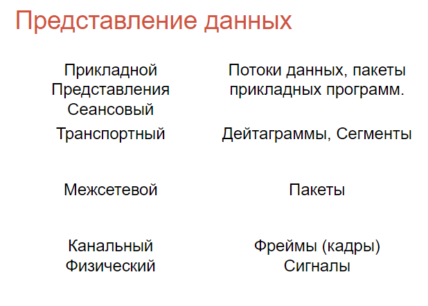

# OSI. Уровни. Какие есть протоколы, зачем нужно и тп

**Сетевая модель OSI (ЭМВОС)** - (базовая эталонная модель взаимодействия открытых систем) - абстрактная сетевая модель для коммуникаций и разработки сетевых протоколов. 

Она предлагает взгляд на компьютерную сеть с точки зрения уровней. 
* Каждый уровень обслуживает свою часть процесса взаимодействия
* В настоящее время практически полностью вытеснена сетевой моделью DoD (или моделью TCP/IP)
* Она делит процесс сетевого взаимодействия на семь уровней, каждый из которых выполняет определенные функции и использует свои протоколы.

**PDU** - Protocol Data Unit - единица данных, которая передается между сетевыми устройствами на различных уровнях модели OSI.
* содержит как полезную нагрузку (данные), так и управляющую информацию, необходимую для правильной маршрутизации и обработки данных
* обеспечивает структурированное представление данных, что позволяет различным уровням модели OSI правильно обрабатывать и передавать информацию. Каждый уровень добавляет свой заголовок к PDU, когда данные проходят через стек протоколов

### 7 - прикладной уровень (application layer)

* Верхний уровень 
* Обеспечивает взаимодействие пользовательских приложений с сетью.
* Позволяет приложениям использовать сетевые службы, такие как удалённый доступ к файлам и базам данных, пересылка электронной почты.
* Отвечает за передачу служебной информации, предоставляет приложениям информацию об ошибках и формирует запросы к уровню представления.

Пример протоколов:
* HTTP (S) для веб-трафика
* SMTP для электронной почты
* IMAP
* FTP для передачи файлов

Пример реализации:
* web-бразуер
* клиент электронной почты

**PDU**:
* Данные (Data)
* Это пользовательские данные, которые приложение отправляет через сеть. На этом уровне данные могут быть в любом формате, подходящем для приложения.

### 6 - Уровень представления (presentstion layer)

* Отвечает за преобразование протоколов и кодирование/декодирование данных
* Представляет собой промежуточный протокол для преобразования информации из соседних уровней; это позволяет осуществлять обмен между приложениями на разнородных компьютерных системах прозрачным для приложений образом.

Пример протокола: 
* SSL для шифрования
* gzip
* RDP
* PNG для изображений
* JPEG для изображений

Пример реализации: 
* OpenSSL
* libz
* приложения «Удаленный доступ к рабочему столу»/rdesktop
* libpng.

**PDU**:
* Данные (Data)
* Описание: Данные, которые могут быть преобразованы или отформатированы для передачи. Этот уровень отвечает за кодирование и шифрование данных.

### 5 - Сеансовый уровень (session layer)

* Отвечает за поддержание сеанса связи, позволяя приложениям взаимодействовать между собой длительное время.
* Управляет созданием/завершением сеанса, обменом информацией, синхронизацией задач, определением права на передачу данных и поддержанием сеанса в периоды неактивности приложений. Синхронизация передачи обеспечивается помещением в поток данных контрольных точек, начиная с которых возобновляется процесс при нарушении взаимодействия.

Пример протокола: 
* NetBIOS
* PPTP (Point-to-Point Tunneling Protocol)
* RPC (Remote Procedure Call)

Пример реализации: 
* Сервис Computer Browser или Samba
* VPN-клиенты и серверы
* реализация удаленных процедур в POSIX-системах (Solaris, Mac OS X, Linux)

**PDU**:
* Данные (Data)
* Описание: Данные, которые управляют сеансами связи между приложениями. Этот уровень обеспечивает синхронизацию и управление обменом данными.

### 4 - Транспортный уровень (transport layer)

* Предназначен для доставки данных без ошибок, потерь и дублирования в той последовательности, как они были переданы.
* Существует множество классов протоколов транспортного уровня, начиная от протоколов, предоставляющих только основные транспортные функции (например, функции передачи данных без подтверждения приема), и заканчивая протоколами, которые гарантируют доставку в пункт назначения нескольких пакетов данных в надлежащей последовательности, мультиплексируют несколько потоков данных, обеспечивают механизм управления потоками данных и гарантируют достоверность принятых данных.
* Обеспечивает надежную передачу данных между конечными устройствами. Он управляет сегментацией данных и контролем ошибок.

Пример протокола: 
* TCP
* UDP
* SCTP 

Пример реализации: 
* драйверы TCP, UDP и SCTP в любой сетевой ОС.

**PDU**:
* Сегмент (Segment) для TCP или Датаграмма (Datagram) для UDP
* На этом уровне данные разбиваются на сегменты или датаграммы, и добавляется информация о портах и контроле ошибок

### 3 - Сетевой уровень (network layer)

* Предназначен для определения пути передачи данных.
* Отвечает за трансляцию логических адресов и имён в физические, определение кратчайших маршрутов, коммутацию и маршрутизацию, отслеживание неполадок и «заторов» в сети.
* Протоколы сетевого уровня маршрутизируют данные от источника к получателю.

Пример протокола:
* IP (Internet Protocol)
* ICMP (Internet Control Message Protocol)
* ARP (Address Resolution Protocol)
* IPX

Пример реализации:
* любой программный или аппаратный маршрутизатор.

**PDU**:
* Пакет (Packet)
* Пакеты содержат информацию о маршрутизации и адресации, позволяя передавать данные между различными сетями.

### 2 - Канальный уровень (data link layer)

* Предназначен для обеспечения взаимодействия сетей на физическом уровне и контроля за ошибками, которые могут возникнуть
* Спецификация IEEE 802 разделяет этот уровень на два подуровня — MAC (Media Access Control) регулирует доступ к разделяемой физической среде, LLC (Logical Link Control) обеспечивает обслуживание сетевого уровня.
* Полученные с физического уровня данные он упаковывает во фреймы, проверяет на целостность, если нужно, исправляет ошибки (посылает повторный запрос поврежденного кадра) и отправляет на сетевой уровень.
* Обеспечивает надежную передачу данных между двумя узлами в одной сети. Он управляет доступом к среде передачи и исправляет ошибки.

Пример протокола: 
* Ethernet (второй уровень)
* PPP  (Point-to-Point Protocol)
* Wi-Fi
* HDLC

Пример реализации: 
* коммутатор
* драйвер PPP
* точка доступа

**PDU**:
* Кадр (Frame)
* Кадры инкапсулируют пакеты для передачи по физическим средам и содержат информацию о MAC-адресах и управлении доступом к среде.

### 1 - Физический уровень (physical layer)

* Предназначен непосредственно для передачи потока данных.
* Осуществляет передачу электрических или оптических сигналов в кабель или в радиоэфир и, соответственно, их приём и преобразование в биты данных в соответствии с методами кодирования цифровых сигналов (осуществляет интерфейс между сетевым носителем и сетевым устройством).
* Отвечает за передачу необработанных битов по физическим средам (кабели, оптоволокно, радиоволны и т.д.). Он определяет электрические, механические и процедурные характеристики.

Пример протокола: 
* Ethernet (для локальных сетей)
* Wi-Fi
* USB 
* DSL

Пример реализации: 
* медь
* воздух
* оптоволокно 
* иными словами среда передачи данных

**PDU**:
* Бит (Bit)
* Биты представляют собой физические сигналы, которые передаются по сетевым средам, таким как кабели или радиоволны.

### Про PDU еще раз

### Зачем

1. Стандартизация: Модель OSI обеспечивает единый стандарт для разработки сетевых протоколов и оборудования. Это позволяет различным производителям создавать совместимые устройства и приложения, что особенно важно в контексте интернета.
2. Обучение и понимание: Модель помогает структурировать знания о сетевых технологиях, что упрощает обучение и понимание принципов работы сетей. Она предоставляет ясную иерархию, которая помогает выявлять проблемы и интегрировать новые технологии.
3. Модульность: Разделение на уровни позволяет разработчикам изменять или обновлять отдельные компоненты без необходимости изменения других. Например, можно изменить алгоритм маршрутизации на сетевом уровне без изменения протоколов на транспортном уровне.
4. Управляемость: Модель OSI позволяет контролировать процесс передачи данных на всех этапах, что упрощает диагностику и устранение проблем.

Преимущества:
* Гибкость: Возможность добавления или изменения отдельных уровней и протоколов позволяет легко адаптироваться к изменениям технологий.
* Надежность: Разделение на уровни помогает локализовать и устранять проблемы и ошибки.
* Упрощение разработки: Четкое разграничение задач облегчает создание, тестирование и корректировку сетевых систем.

Недостатки:
* Сложность: Семь уровней и множество стандартов делают модель довольно сложной для изучения и реализации. Это может усложнить разработку и отладку сетевых решений.
* Негибкость: Модель была разработана в 1980-х годах и не учитывает многие современные технологии, такие как облачные вычисления или мобильные устройства.
* Неэффективность: Разделение взаимодействия на отдельные слои может привести к избыточным операциям и потере производительности. В реальных сетях часто используются протоколы, которые комбинируют функции нескольких слоев для повышения эффективности.
* Ограниченное применение: Несмотря на теоретическую важность модели OSI, она не нашла широкого применения на практике по сравнению с моделью TCP/IP, которая стала основой современного интернета.

