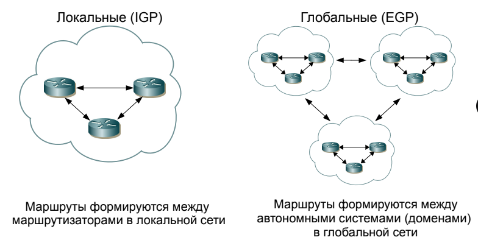

# Маршрутизация, статическая, динамическая. Шлюз по умолчанию. Таблица маршрутизации.

## Маршрутизация, статическая, динамическая

**Маршрутизация** - Routing - процесс определения маршрута следования информации в сетях связи.
* Маршруты могут задаваться административно (_статические маршруты_), либо вычисляться с помощью алгоритмов маршрутизации, базируясь на информации о топологии и состоянии сети, полученной с помощью протоколов маршрутизации (_динамические маршруты_)
* Процесс маршрутизации в компьютерных сетях выполняется специальными программно-аппаратными средствами - **маршрутизаторами**

### Маршрутизация работает на третьем уровне модели OSI (сетевой) и не зависит от протоколов более высоких или более низких уровней.

Благодаря маршрутизации узел из одного адресного пространства может общаться с узлом из другого адресного пространства

#### Схемы маршрутизации

**Unicast** - метод маршрутизации, при котором данные отправляются от одного источника к одному конкретному получателю.
* наиболее распространенный способ
* каждый пакет данных адресуется конкретному IP-адресу получателя
* неэффективен при необходимости отправки одинаковых данных множеству получателей
* эффективен, когда надо одному отправлять

**Broadcast** - метод, при котором одно сообщение отправляется всем устройствам в сети.
* широковещательные сообщения адресуются специальному широковещательному адресу
* используется для обнаружения устройств в сети -> например ARP
* отправка сообщений всем узлам
* может привести к перегрузке сети из-за большого трафика
* широковещательные сообщения не маршрутизируются за пределами локальной сети

**Multicast** - метод, при котором данные отправляются от одного источника к группе получателей
* ?????? Для этого используется специальный диапазон IP-адресов (например, 224.0.0.0 до 239.255.255.255 в IPv4)
* Используется для потоковой передачи видео и аудио (например, IPTV).
* Применяется в видеоконференциях и других приложениях, где данные нужно отправлять нескольким пользователям одновременно.
* Эффективность: данные передаются только один раз и дублируются только для тех, кто подписан на группу.
* Снижение нагрузки на сеть по сравнению с unicast.

**Anycast** - метод маршрутизации, при котором данные отправляются к ближайшему из группы возможных получателей с одинаковым адресом
* Это позволяет оптимизировать маршруты и уменьшить задержку
* Используется в системах распределенных серверов, например, для DNS-сервисов.
* Применяется для балансировки нагрузки и повышения доступности.
* Оптимизация маршрутов: пакеты направляются к ближайшему доступному узлу.
* Повышенная отказоустойчивость: если один узел недоступен, трафик автоматически перенаправляется на другой.
* Меньшая предсказуемость по сравнению с unicast, так как конечный получатель может меняться.
* Требует более сложной настройки сетевой инфраструктуры.

### Методы маршрутизации 

* одношаговые - каждый маршрутизатор отвечает за один этап пути. Окончательный маршрут складывается из результатов всех шагов последовательных
* маршрутизация от источника - узел-источник указывает в пакете полный маршрут через все промежуточные маршрутизаторы

В зависимости от способа формирования таблиц маршрутизации принято выделять три основных класса методов:
* Статическая
* Простая (basic, базовая) 
* Динамическая

#### Статическая

* основана на выборе пути на основе статических (внесенных в ТМ системным администратором) или прямых (непосредственных, directly connected) маршрутов (созданных автоматически на основе непосредственно подключенных сетей к интерфейсам маршрутизатора).
* используется в небольших или стабильных сетях, где топология редко меняется
* простота настройки и предсказуемость поведения
* негибкость. все вручную менять надо

#### Простая 

В алгоритмах простой маршрутизации таблица маршрутизации либо вовсе не используется, либо строится без участия протоколов маршрутизации. 

Выделяют три типа простой маршрутизации:
* случайная маршрутизация -> прибывший пакет посылается в первом попавшемся направлении, кроме исходного
* лавинная маршрутизация -> пакет посылается широковещательно по всем возможным направлениям, кроме исходного
* маршрутизация с учетом накопленного опыта -> когда выбор маршрута осуществляется по таблице, но таблица строится так же, как и в случае коммутатора, путем анализа адресных полей.

#### Динамическая

**Динамическая** (адаптивная) маршрутизация основана на динамических записях в таблицах маршрутизации, которые появляются там в результате работы алгоритмов _динамической маршрутизации_.

Алгоритмы динамической маршрутизации (далее – просто алгоритмы маршрутизации) не осуществляют непосредственно саму маршрутизацию пакетов, этим занимаются методы маршрутизации; алгоритмы маршрутизации заполняют ТМ динамическими записями, которые в последствии могут быть использованы методами маршрутизации.

В ТМ могут одновременно присутствовать как статические, так и динамические или «простые» маршруты.

Алгоритмы маршрутизации:
* **централизованные** и **децентрализованные**
* **внутридоменные** (внутрисистемные, локальные,
  interior gateway protocols, IGP) или **междоменные**
  (межсистемные, глобальные, exterior gateway
  protocols, EGP);
* работающие на основе определения состояния
  канала (Link State Algorithm, LSA) или вычисления
  вектора расстояний (Distance Vector Algorithm, DVA)

##### Централизованные и децентрализованные

Централизованные:
1. Сбор информации: Каждый узел передает данные о своем состоянии (например, задержки, пропускные способности) центральному маршрутизатору.
2. Вычисление маршрутов: Центральный узел анализирует собранную информацию и вычисляет оптимальные маршруты для передачи данных.
3. Рассылка таблиц маршрутизации: После вычисления маршрутов центральный узел рассылает таблицы маршрутизации всем узлам сети.
* Оптимизация: Централизованный контроллер имеет полную информацию о состоянии сети, что позволяет принимать более обоснованные решения.
* Упрощение управления: Узлы освобождены от необходимости самостоятельно вычислять маршруты.
* Единственная точка отказа: Если центральный узел выходит из строя, вся сеть может остановиться.
* Концентрация трафика: Может возникнуть перегрузка трафика вблизи центрального узла.

Децентрализованные:
1. Локальная информация: Каждый узел использует информацию о своих ближайших соседях для принятия решений о маршруте.
2. Обмен данными: Узлы могут обмениваться информацией о состоянии своих соединений с другими узлами, чтобы улучшить выбор маршрута.
3. Поиск оптимального пути: Узлы могут использовать различные алгоритмы для нахождения оптимального пути на основе локальных данных.
* Отказоустойчивость: Если один из узлов выходит из строя, другие узлы могут продолжать функционировать.
* Гибкость: Сеть может адаптироваться к изменениям в топологии без необходимости вмешательства центрального контроллера.
* Сложность управления: Требуется больше вычислительных ресурсов на каждом узле для анализа и принятия решений.
* Меньшая оптимизация: Решения могут быть менее оптимальными по сравнению с централизованными алгоритмами из-за недостатка глобальной информации.

##### Локальные и глобальные

##### Link state и distance vector

Метрика:
* Метрика представляет собой числовую характеристику маршрута, такую, например, как полоса пропускания канала, и используется алгоритмами динамической маршрутизации для определения оптимального пути к получателю данных.
* В качестве метрики могут быть использованы как различные характеристики маршрута (число маршрутизаторов, ширина и скорость каналов, надежность линий связи, географические характеристики и др.), так и их комбинации.

Дистанционно-векторные алгоритмы:
* Распределенные: Каждый маршрутизатор работает независимо, обмениваясь информацией с соседями.
* Итерационные и асинхронные: Обновления маршрутов происходят по мере получения новой информации от соседей.
* Принцип работы: Основной принцип — "расскажи соседям о том, как выглядит мир" (tell neighbours about the world). Каждый узел сообщает своим соседям о своих расстояниях до других узлов.
* Каждый узел ведет таблицу маршрутизации, которая содержит вектор с двумя компонентами: выбранный маршрут и дистанция (например, количество хопов или задержка).
* Узел оценивает дистанцию до каждого соседа и рассылает эту информацию, что позволяет всем узлам пересчитывать свои таблицы маршрутизации.
* Дистанционно-векторные алгоритмы основаны на алгоритме **Форда-Беллмана**, который позволяет находить кратчайшие пути в графах.
* RIP (Routing Information Protocol) — классический протокол, использующий дистанционно-векторный подход.

Алгоритмы состояния каналов:
* Соседство: Маршрутизаторы, разделяющие общий канал передачи данных, считаются соседями.
* Обмен состояниями: Маршрутизаторы обмениваются объявлениями о состоянии каналов. Каждое объявление содержит информацию о состоянии линий связи.
* Каждый маршрутизатор создает базу данных состояния каналов, которая содержит информацию о всех соединениях в сети.
* После получения обновлений от соседей маршрутизаторы обновляют свою базу данных и используют её для построения таблицы маршрутизации.
* Для вычисления кратчайших путей используется алгоритм "кратчайший путь первым" (Shortest Path First — SPF), основанный на алгоритме **Дейкстры**. Он позволяет построить дерево кратчайшего пути от каждого маршрутизатора к другим узлам сети.
* протокол OSPF (дальше будет)

##### проблемки

Проблемы алгоритмов маршрутизации могут значительно повлиять на эффективность и безопасность сетей. Вот краткий обзор основных проблем:
* Увеличение служебного трафика: Все алгоритмы маршрутизации требуют обмена пакетами между маршрутизаторами, что приводит к увеличению объема служебного трафика в сети. Это может негативно сказаться на производительности сети.
* Уязвимость к атакам: Безопасность сети снижается, так как злоумышленники могут подделывать маршруты и организовывать атаки типа «man-in-the-middle», перехватывая и изменяя данные.
* Необходимость в конвергенции: Конвергенция — это время, необходимое для согласования всех маршрутов между узлами после изменений в топологии сети. Длительное время конвергенции может привести к потере пакетов и снижению производительности.
* Циклы маршрутизации: Возможны ситуации, когда маршрутизаторы имеют противоречивую информацию о маршрутах, что приводит к циклам. Например, маршрутизатор A считает, что шлюзом в сеть 10.0.0.0 является маршрутизатор B, а тот, в свою очередь, считает, что шлюзом является A.
* «Черные дыры»: Возникают из-за сбоев в работе алгоритмов, когда пакеты теряются в сети и не достигают своего назначения. Примером является инцидент AS 7007, когда неверные маршруты привели к потере значительного объема трафика.

## Таблица маршрутизации. Шлюз по умолчанию

### Маршрутизация в IP-сетях

Модель OSI - 3 уровень (сетевой)

Модель DoD - 2 уровень (межсетевой)

**Таблица маршрутизации** — это ключевой элемент в работе маршрутизаторов, который используется для определения, как передавать пакеты данных от источника к получателю. Она представляет собой структуру данных, хранящую информацию о маршрутах к различным сетям и узлам.

Таблица обычно содержит поля:
* IP-адрес назначения (сети или узла)
* Маска подсети
* Шлюз (куда направить, если подходит IP)
* Интерфейс (указывает локальный интерфейс маршрутизатора, через который будет отправлен пакет)
* Метрика (Числовое значение, указывающее предпочтительность маршрута. Чем меньше значение, тем более предпочтителен маршрут)

**Шлюз по умолчанию** — это специальный маршрут в таблице маршрутизации, который используется для отправки пакетов, адресованных за пределами локальной сети или когда не найдено конкретного маршрута для указанного IP-адреса.
* Шлюз по умолчанию обычно обозначается как маршрут с IP-адресом назначения 0.0.0.0 и маской 0.0.0.0.
* Если пакет не соответствует ни одному из других маршрутов в таблице, он будет отправлен на шлюз по умолчанию.

**Непосредственные** (directly connected) **маршруты** – записи в ТМ, содержащие информацию об адресном пространстве непосредственно подключенных интерфейсов маршрутизатора.
* тоже особые записи в ТМ как шлюз по умолчанию

Когда устройство (например, компьютер или маршрутизатор) отправляет IP-пакет:
1. Проверка таблицы маршрутизации: Устройство проверяет свою таблицу маршрутизации на наличие записи для IP-адреса назначения.
2. Выбор следующего шага: Если запись найдена, пакет отправляется на указанный шлюз через соответствующий интерфейс.
3. Обработка пакета: Если запись не найдена, пакет будет отправлен на шлюз по умолчанию. Ну или потеряется
4. Уменьшение TTL: При прохождении через каждый маршрутизатор значение TTL (Time To Live) пакета уменьшается на единицу, что предотвращает бесконечное циркулирование пакетов в сети.

ARP (Address Resolution Protocol): Для определения MAC-адресов устройств в локальной сети используется ARP, который работает в связке с таблицей маршрутизации.

#### Приоритетность маршрутов

Приоритетность маршрутов — это механизм, определяющий, какой из нескольких возможных маршрутов будет выбран при передаче пакета.
* Как работает: Когда в таблице маршрутизации есть несколько маршрутов к одной и той же сети, маршрутизатор выбирает наиболее конкретный или оптимальный маршрут.

Факторы приоритета:
* Наиболее конкретный префикс (Longest Prefix Match): Маршрут с наиболее длинной маской подсети (например, /24 более конкретный, чем /16) будет предпочтительным.
* Метрика: Маршруты с меньшей метрикой (стоимостью) более предпочтительны (используется в динамической маршрутизации).
* Административное расстояние (Administrative Distance): Применяется, когда есть маршруты, полученные разными протоколами маршрутизации. Маршруты с меньшим административным расстоянием более предпочтительны.

Пример: Если у маршрутизатора есть два маршрута к сети 192.168.2.0:
* Маршрут 1: 192.168.2.0/24 via 192.168.1.2
* Маршрут 2: 192.168.0.0/16 via 192.168.1.3
* Пакет, предназначенный для 192.168.2.10, будет отправлен через маршрут 1, так как маска /24 является более конкретной, чем /16.

### ICMP

ICMP — Internet Control Message Protocol - это протокол, который используется для передачи управляющих сообщений и сообщений об ошибках в IP-сетях. Он является важным компонентом стека протоколов TCP/IP и выполняет несколько ключевых функций, связанных с маршрутизацией и управлением сетью.
* Сообщения об ошибках: ICMP позволяет маршрутизаторам и узлам сообщать об ошибках, возникающих при передаче пакетов. Это включает в себя уведомления о недоступности сети, хоста или маршрута.
* Управление маршрутизацией: ICMP может использоваться для обновления таблиц маршрутизации, предоставляя информацию о более оптимальных маршрутах.

Типы ICMP-сообщений
* Тип 3 (Destination Unreachable): Генерируется маршрутизатором, если не найден маршрут к адресу назначения. Например, если пакет направлен в сеть, которая недоступна, маршрутизатор отправляет сообщение типа 3 с кодом, указывающим на причину недоступности.
* Тип 5 (Redirect): Используется для обновления записей в таблице маршрутизации отправителя. Это сообщение информирует узел о том, что существует более оптимальный маршрут к адресу назначения.
* Тип 9 (Router Advertisement): Устаревшее сообщение, которое использовалось для объявления о маршрутизаторе.
* Тип 11 (Time Exceeded): Генерируется маршрутизатором, когда истекает срок жизни (TTL) пакета. Это предотвращает бесконечное циркулирование пакетов в сети.

#### IP и маршрутизация от источника

Протокол IP также поддерживает специальные опции в заголовке пакета:
* LSRR (Loose Source Routing Record): Позволяет указать набор IP-адресов маршрутизаторов, которые будут предпочтительными при передаче пакета.
* SSRR (Strict Source Routing Record): Обязывает пакет следовать заданному порядку через указанные маршрутизаторы; если это невозможно, пакет будет отброшен.

Ограничения
* Размер цепочки для LSRR и SSRR ограничен длиной опции: максимум 224 байта или 7 маршрутизаторов.
* SSRR из соображений безопасности не применяется в современных сетях и часто запрещен на маршрутизаторах.
* LSRR используется в основном в беспроводных сетях для управления маршрутами.

## Протоколы динамической маршрутизации ((

## OSPF
OSPF — это протокол динамической маршрутизации, который использует технологию отслеживания состояния канала (link-state technology) и алгоритм Дейкстры для нахождения кратчайшего пути. Он был разработан IETF в 1988 году и является стандартом для маршрутизации внутри автономных систем (IGP).

Основные характеристики OSPF
* Работа на сетевом уровне: OSPF функционирует поверх протокола IP и предназначен для обмена маршрутной информацией между маршрутизаторами в одной автономной системе.
* Уникальный идентификатор маршрутизатора (RID): Каждый маршрутизатор получает уникальный идентификатор, основанный на самом старшем IP-адресе его интерфейсов.
* Метрика: OSPF использует коэффициент качества обслуживания (cost) в качестве метрики для определения оптимальных маршрутов.

Определения ключевых терминов
* **Интерфейс** (link): Соединение маршрутизатора с сетью.
* **Состояние канала** (link state): Информация о состоянии соединения между двумя маршрутизаторами.
* **Зона** (area): Группа сетей и маршрутизаторов с общим идентификатором.
* **Соседи** (neighbours): Маршрутизаторы, имеющие общие интерфейсы в одной сети.
* **Состояние соседства** (adjacency): Связь между соседними маршрутизаторами для обмена маршрутной информацией.
* **База данных состояния каналов** (LSDB): Хранит информацию о состоянии всех каналов.

### Механизм работы OSPF

1 - Установление связей с соседями:
* Каждые 10 или 30 секунд маршрутизаторы отправляют Hello-пакеты для обнаружения соседей и установления состояния линии.
* Если два маршрутизатора согласны по параметрам, они становятся соседями.

2 - Выбор DR и BDR:
* В сетях с топологией "шина" выбираются выделенный маршрутизатор (DR) и резервный выделенный маршрутизатор (BDR), которые управляют рассылкой LSA.

3 - Обнаружение всех маршрутов:
* Маршрутизаторы обмениваются информацией о состоянии каналов, чтобы построить полную картину сети.

4 - Выбор наилучших маршрутов:
* Используя алгоритм Дейкстры, OSPF вычисляет кратчайшие пути на основе стоимости.

5 - Поддержка и обновление таблиц маршрутизации:
* OSPF постоянно мониторит состояние сети и обновляет таблицы маршрутизации при изменениях.

### Зоны в OSPF

Это совокупность сетей и маршрутизаторов, имеющих
один и тот же идентификатор зоны.

* Зоны помогают сократить время конвергенции и уменьшить нагрузку на сеть.
* В каждой сети должна быть зона с идентификатором 0, которая является основной зоной.
* Максимальное количество маршрутизаторов в зоне ограничено 150, но на практике может достигать 500.

### Плюсы минусы

Достоинства:
* Поддержка CIDR, что позволяет более эффективно использовать адресное пространство.
* Высокая скорость конвергенции, что критично для больших сетей.
* Использование мультикастинга вместо широковещательных сообщений снижает нагрузку на сеть.
* Возможность равномерного распределения трафика между эквивалентными маршрутами.

Недостатки:
* Высокие требования к вычислительным ресурсам из-за необходимости обработки большого объема информации о состоянии каналов.
* Возможность десинхронизации LSDB между соседями, что может привести к ошибкам в маршрутизации.
* Необходимость выбора DR/BDR может усложнять настройку в больших сетях.

## RIP

RIP - Routing Information Protocol -  это один из первых и самых простых протоколов динамической маршрутизации, используемый для обмена маршрутной информацией в небольших сетях. Он работает на основе технологии векторной маршрутизации и использует количество хопов (переходов) в качестве метрики для выбора маршрутов.

Основные характеристики RIP
* Тип протокола: Протокол внутренней маршрутизации (IGP), предназначенный для использования внутри автономной системы.
* Версии: Существуют две версии — RIPv1 и RIPv2.
   1. RIPv1: Не поддерживает подсетевую адресацию (VLSM) и не передает информацию о масках подсетей.
   2. RIPv2: Поддерживает VLSM и CIDR, передает информацию о масках подсетей.
   
* Метрика: Использует количество хопов в качестве метрики. Максимальное количество хопов, разрешенное в RIP, составляет 15. Значение 16 обозначает недоступный маршрут.
* Обновления: Каждые 30 секунд маршрутизаторы рассылают полную таблицу маршрутизации всем соседям, что может создавать нагрузку на сеть.
* Простота: RIP прост в настройке и использовании, что делает его подходящим для небольших сетей.

Таблица маршрутизации RIP содержит записи для каждого маршрута и включает следующие поля:
* IP-адрес назначения: Адрес сети или узла назначения.
* Метрика маршрута: Количество хопов до назначения.
* IP-адрес ближайшего маршрутизатора: Адрес следующего маршрутизатора на пути к назначению.
* Таймеры маршрута: Используются для управления обновлениями и временем жизни записей.

### Механизм работы RIP

1 - Обмен маршрутной информацией:
* Каждый маршрутизатор отправляет свои обновления всем соседям каждые 30 секунд. Это позволяет соседним маршрутизаторам обновлять свои таблицы маршрутизации.

2 - Выбор лучшего маршрута:
* Маршрутизаторы выбирают маршрут с наименьшим количеством хопов как лучший путь к сети назначения.

3 - Обработка изменений в топологии:
* Если маршрут становится недоступным, маршрутизаторы обновляют свои таблицы, устанавливая метрику равной 16 (недоступно).

### Формат пакета RIP

Пакеты RIP содержат несколько полей, включая:
* Команда: Определяет тип сообщения (например, запрос или обновление).
* Версия: Указывает версию протокола (RIPv1 или RIPv2).
* Идентификатор семейства адресов: Указывает тип используемого адреса (например, IPv4).
* IP-адрес назначения: Адрес сети назначения.
* Метрика: Количество хопов до назначения.

### Плюсы минусы

Достоинства:
* Простота настройки и использования.
* Подходит для небольших сетей с однородной топологией.
* Легко реализуется на большинстве сетевых устройств.

Недостатки:
* Ограничение по количеству хопов (максимум 15), что делает его непригодным для больших сетей.
* Частые обновления могут создавать избыточный трафик на низкоскоростных линиях связи.
* Медленная конвергенция по сравнению с более современными протоколами, такими как OSPF.

