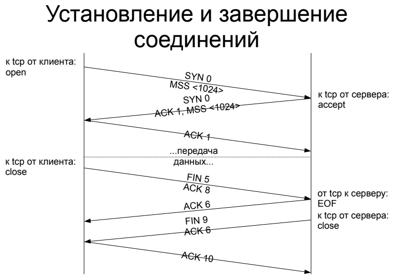
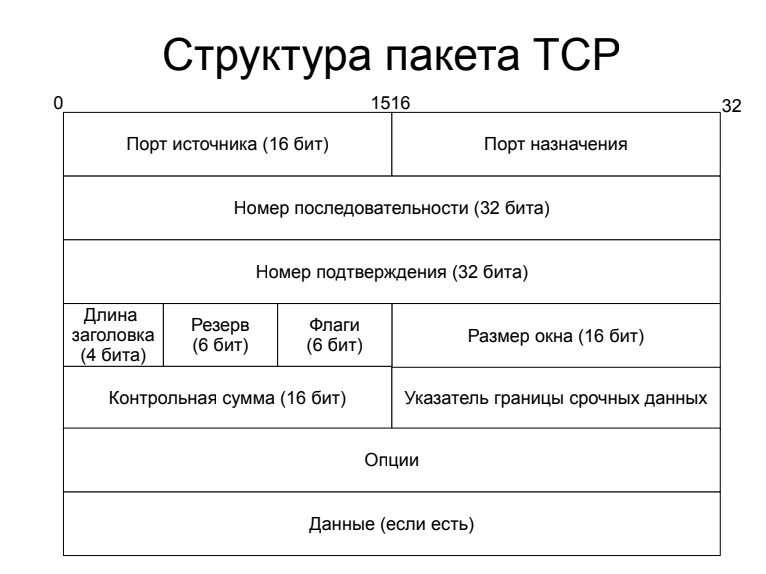
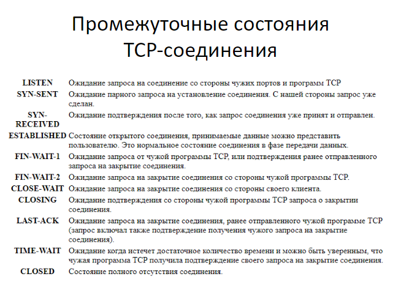
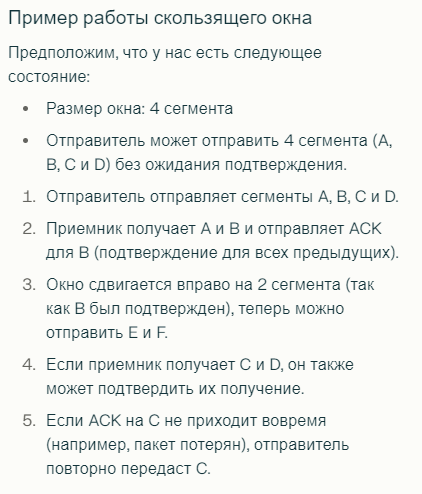
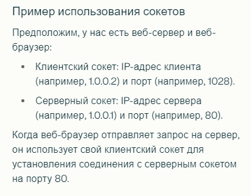
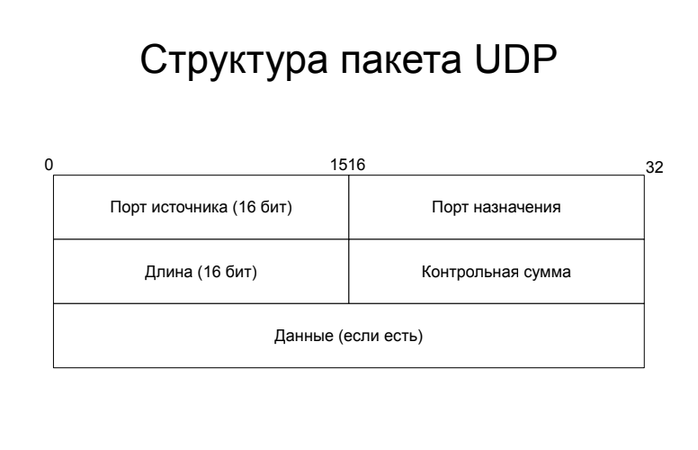
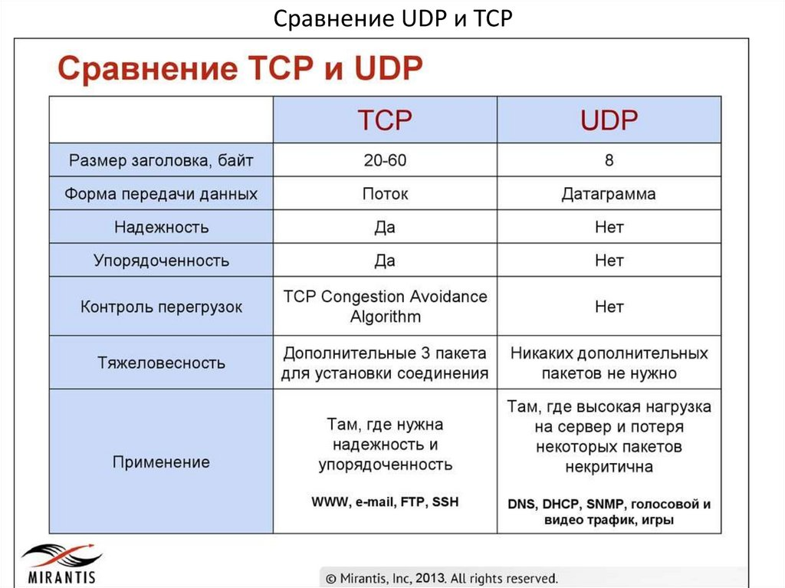
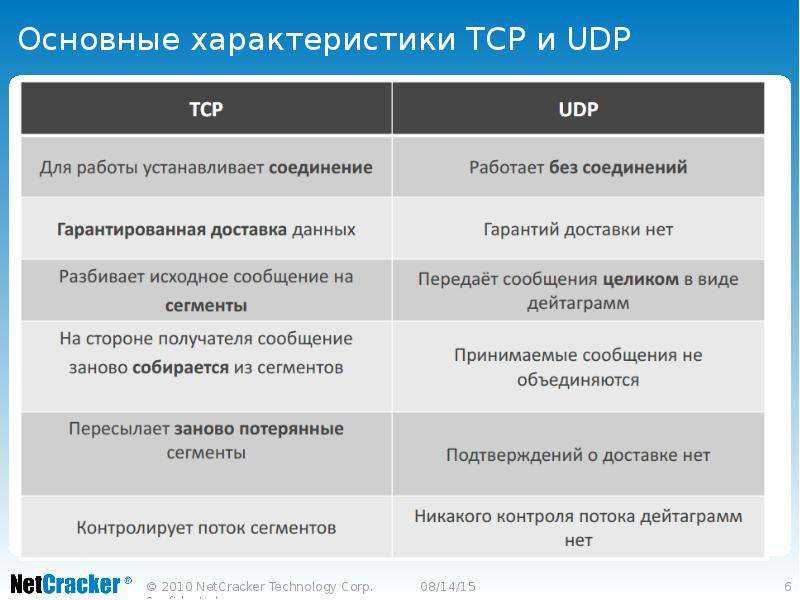

# TCP протокол. Процессы, трехэтапное рукопожатие, заголовки TCP, флаги. Окно. Порты. Сокеты. Соединение. UDP. Разница между протоколами. MTU

TCP/IP (Transmission Control Protocol/Internet Protocol) — это набор протоколов, который служит основой для передачи данных в сети Интернет и других компьютерных сетях. Эта модель описывает, как данные передаются от одного устройства к другому, и включает в себя несколько уровней, каждый из которых выполняет свои функции.

Модель TCP/IP состоит из четырех уровней:
1. Прикладной уровень (Application Layer):
    * Этот уровень отвечает за взаимодействие с конечными пользователями и приложениями. Он включает протоколы, которые обеспечивают доступ к сетевым услугам.
    * Примеры протоколов: HTTP (для веб-трафика), FTP (для передачи файлов), SMTP (для электронной почты).
2. Транспортный уровень (Transport Layer):
    * Обеспечивает надежную передачу данных между конечными узлами. Он управляет сегментацией данных, контролем ошибок и восстановлением потерянных пакетов.
    * Основные протоколы:
        * TCP: Обеспечивает надежную, ориентированную на соединение передачу данных.
        * UDP: Предоставляет ненадежную, без установления соединения передачу данных.
3. Сетевой уровень (Internet Layer):
    * Отвечает за маршрутизацию пакетов данных через различные сети. Он управляет адресацией и определяет, как пакеты будут передаваться от источника к получателю.
    * Основной протокол: IP (Internet Protocol), который отвечает за адресацию устройств и маршрутизацию пакетов.
4. Канальный уровень (Link Layer):
    * Обеспечивает физическую передачу данных по сети. Этот уровень управляет взаимодействием с сетевым оборудованием и определяет, как данные будут передаваться по физическим каналам связи.
    * Примеры протоколов: Ethernet, Wi-Fi, PPP.

Процесс передачи данных
1. Формирование пакетов: Данные приложения разбиваются на пакеты на транспортном уровне.
2. Маршрутизация: Пакеты передаются на сетевой уровень, где им присваиваются IP-адреса назначения.
3. Передача через канальный уровень: Пакеты передаются через физическую среду с использованием протоколов канального уровня.
4. Обработка на стороне получателя: Полученные пакеты собираются обратно в данные на транспортном уровне и передаются приложению.

## TCP

**TCP** (Transmission Control Protocol) — это протокол транспортного уровня, который обеспечивает надежную, ориентированную на соединение передачу данных между устройствами в сети. Он является одним из основных протоколов стека TCP/IP и используется для передачи данных в различных приложениях, таких как веб-серфинг, электронная почта и передача файлов.

TCP гарантирует, что приложение получит данные точно в такой же последовательности, в какой они были отправлены, и без потерь.

TCP-порт – это мультиплексная очередь сообщений.

Основные характеристики TCP
1. Установление соединения:
   * TCP устанавливает соединение между отправителем и получателем перед началом передачи данных. Это достигается через процесс, известный как трехэтапное рукопожатие.
2. Надежность:
   * TCP гарантирует доставку данных без потерь и в правильном порядке. Если пакеты теряются или повреждаются, они автоматически перезапрашиваются.
3. Управление потоком:
   * TCP регулирует скорость передачи данных, чтобы избежать перегрузки сети, используя механизм окна.
4. Контроль ошибок:
   * TCP использует контрольные суммы для проверки целостности данных, что позволяет обнаруживать и исправлять ошибки, возникшие при передаче.

Основные процессы TCP:
1. Установка соединения:
    * Перед началом передачи данных между двумя устройствами необходимо установить соединение. Это происходит через процесс, известный как трехэтапное рукопожатие.
2. Передача данных:
    * После установки соединения данные разбиваются на сегменты и передаются по сети. Каждый сегмент нумеруется, что позволяет получателю собирать их в правильном порядке.
3. Завершение соединения:
    * После завершения передачи данных обе стороны закрывают соединение, что также требует обмена специальными сообщениями.

Процесс установки соединения в TCP включает три шага (3-х этапное рукопожатие):
1. SYN: Клиент отправляет серверу пакет с флагом SYN (synchronize), чтобы инициировать соединение.
2. SYN-ACK: Сервер отвечает пакетом с флагами SYN и ACK (acknowledge), подтверждая получение запроса на соединение.
3. ACK: Клиент отправляет серверу пакет с флагом ACK, подтверждая установление соединения.

Передача данных:
* При обмене данными приемник использует номер
  последовательности, содержащийся в получаемых сегментах,
  для восстановления их исходного порядка. Приемник уведомляет
  передающую сторону о номере последовательности, до которой
  он успешно получил данные, включая его в поле «номер
  подтверждения». На любую оговоренную последовательность
  данных приемник обязан ответить подтверждением (ACK).

Процесс завершения соединения:
* Инициатор посылает сегмент с флагом FIN/ACK;
* Получатель подтверждение запрос на закрытие и отправляет
сегмент ACK;
* Получатель отправляет сегмент FIN/ACK;
* Инициатор закрывает соединение и в подтверждение
отправляет сегмент ACK, что соединение закрыто.

**Заголовок TCP** содержит важную информацию для управления передачей данных. Основные поля заголовка включают:
* Порт источника: Номер порта отправителя.
* Порт назначения: Номер порта получателя.
* Последовательный номер: Уникальный номер для отслеживания порядка пакетов.
* Номер подтверждения: Указывает следующий ожидаемый байт от отправителя.
* Флаги: Указывают состояние соединения (например, SYN, ACK, FIN).
* Размер окна: Определяет количество байтов, которые могут быть отправлены до получения подтверждения.
* Контрольная сумма: Используется для проверки целостности данных.
* Указатель границы срочных данных: Указывает на конец срочных данных в потоке.

Флаги в заголовке TCP указывают на состояние соединения:
* SYN: Устанавливает соединение.
* ACK: Подтверждает получение данных.
* FIN: Завершает соединение.
* RST: Сбрасывает соединение.
* PSH: Указывает на необходимость немедленной передачи данных.
* URG: Указывает на наличие срочных данных.

RTT (время кругового обращения) — это время, необходимое для отправки пакета данных от отправителя к получателю и получения подтверждения о его доставке обратно к отправителю. Это ключевой параметр в сетевых протоколах, таких как TCP, который помогает управлять тайм-аутами и повторными передачами данных.

Основные аспекты RTT
1. Измерение времени:
   * RTT включает время, затраченное на передачу пакета по сети и время, необходимое для обработки этого пакета на принимающей стороне.
   * Это время может варьироваться в зависимости от загруженности сети, расстояния между узлами и других факторов.
2. Влияние на производительность:
   * Производительность протокола TCP во многом зависит от правильного выбора тайм-аута, который основан на значении RTT. Если тайм-аут установлен слишком коротким, это может привести к ненужным повторным передачам; если слишком длинным — к задержкам в передаче данных.
3. Алгоритм определения тайм-аута:
   1. узнать время оборота
   2. усреднить времена весовыми коэффициентами
   3. В качестве тайм-аута выбирается среднее время оборота, умноженное на специальный коэффициент (на практике значение этого коэффициента должно превышать 2). Это позволяет учесть возможные задержки и обеспечить надежность передачи данных.

### Окно (скользящее окно)

**Скользящее окно** — это метод управления потоком данных в протоколе TCP, который позволяет отправителю передавать несколько сегментов данных, не дожидаясь подтверждения каждого из них. Этот механизм повышает эффективность использования пропускной способности сети и уменьшает задержки в передаче данных.

Основные концепции скользящего окна
1. Нумерация байтов:
    * Каждому байту данных в TCP присваивается уникальный номер. Нумерация начинается с первого байта данных, который отправляется, и продолжается для всех последующих байтов.
    * Номер очереди для первого байта данных в сегменте передается вместе с этим сегментом и называется номером очереди для сегмента.
2. Размер окна:
    * Размер окна определяет количество байтов, которые могут быть отправлены без получения подтверждения от получателя. Это значение может динамически изменяться в зависимости от состояния сети и возможностей принимающей стороны.
    * Например, если размер окна составляет 8 сегментов, отправитель может отправить 8 сегментов данных без ожидания подтверждения.
3. Подтверждение (ACK):
    * Приемник использует номер последовательности, содержащийся в получаемых сегментах, для восстановления их исходного порядка. Он отправляет подтверждение (ACK) о том, что данные до определенного номера были успешно получены.
    * Номер подтверждения указывает на следующий ожидаемый байт данных.
4. Скользящее окно:
    * Когда отправитель получает ACK на первый байт (или сегмент), окно "скользит" вправо, позволяя отправить новые данные. Это позволяет поддерживать постоянный поток передачи данных и минимизировать время простоя.
    * При этом сегменты, находящиеся за пределами окна (т.е. те, которые еще не были подтверждены), не могут быть отправлены до получения соответствующих подтверждений.

Процесс работы скользящего окна
1. Отправка данных:
    * Отправитель начинает передачу данных, помещая их в окно. Сначала он отправляет сегменты данных, которые находятся в пределах установленного размера окна.
2. Получение подтверждений:
    * Как только приемник получает данные, он отправляет обратно ACK с номером следующего ожидаемого байта.
    * Если все данные до номера N были успешно получены, ACK будет содержать номер N.
3. Сдвиг окна:
    * После получения ACK окно сдвигается вправо на количество байтов, соответствующее количеству полученных и подтвержденных данных.
    * Это позволяет отправителю передавать новые данные без ожидания.
4. Управление потоком:
    * Если приемник не может обработать больше данных (например, его буфер заполнен), он может установить размер окна равным нулю. Это сигнализирует отправителю остановить передачу данных до тех пор, пока не будет получено новое значение окна.

## Порты

**Порт** — это идентифицируемый номер, который выделяется приложению на сетевом хосте для связи с другими приложениями. Порты позволяют различным приложениям на одном устройстве одновременно использовать сетевые ресурсы, не мешая друг другу.

Основные характеристики портов
* Нумерация портов:
   * Для протоколов TCP и UDP стандарт определяет возможность выделения до 65536 уникальных портов, идентифицируемых номерами от 0 до 65535.
* Порты делятся на три категории:
   * Общеизвестные порты (0-1023): Используются для системных служб и стандартных приложений (например, HTTP — 80, FTP — 21).
   * Зарегистрированные порты (1024-49151): Используются для пользовательских приложений и могут быть назначены различным сервисам.
   * Динамические или частные порты (49152-65535): Обычно назначаются динамически для временных соединений.
* Назначение портов:
   * Приложения-серверы "слушают" на определенных портах, ожидая входящих соединений.
   * Клиентские приложения могут запрашивать конкретный номер порта или использовать автоматически назначенные порты в верхнем диапазоне (>1023).
* Независимость TCP и UDP:
   * Порты TCP не пересекаются с портами UDP. Например, порт 1234 для TCP может использоваться одновременно с портом 1234 для UDP без конфликтов, так как они обрабатываются независимо.

## Сокеты
**Сокет** — это программный интерфейс, который представляет собой конечную точку соединения в сети.
* это комбинация IP-адреса и номера порта, которая однозначно идентифицирует конечную точку соединения в сети. Сокеты используются для обмена данными между процессами.

Он используется для обмена данными между процессами и включает в себя:
* Клиентские сокеты: Инициируют соединение с сервером.
* Серверные сокеты: Ожидают входящих соединений от клиентов.

Сокеты позволяют приложениям взаимодействовать через сеть, используя комбинацию IP-адреса и номера порта.

## Процесс взаимодействия через порты и сокеты

1. Установление соединения:
    * Клиент создает сокет и отправляет запрос на установление соединения к серверу через его известный порт.
    * Сервер принимает запрос на своем сокете и устанавливает соединение.
2. Передача данных:
    * Данные передаются между клиентом и сервером через открытые сокеты. Каждый сегмент данных содержит информацию о номере порта источника и назначения.
3. Завершение соединения:
    * После завершения передачи данных обе стороны закрывают свои сокеты, что освобождает занятые ресурсы

## UDP

**UDP** (User Datagram Protocol) — это простой протокол транспортного уровня, который обеспечивает неориентированную на соединение службу доставки данных, известную как дейтаграммы. Он работает по принципу «максимального усилия», что означает, что получение всех дейтаграмм или правильной последовательности не гарантируется

Основные характеристики UDP
* Неориентированность на соединение:
    * UDP не требует предварительного установления соединения между отправителем и получателем. Это позволяет значительно сократить время на обмен данными и минимизировать задержки.
* Отсутствие гарантии доставки:
    * Протокол не обеспечивает подтверждение получения данных. Если пакет теряется в процессе передачи, UDP не инициирует повторную отправку. Это делает его ненадежным, но подходит для приложений, где скорость важнее надежности.
* Использование в специфических приложениях:
    * UDP часто используется в приложениях, которые не требуют подтверждения доставки, таких как DNS (Domain Name System), SNMP (Simple Network Management Protocol), TFTP (Trivial File Transfer Protocol), а также для потоковой передачи видео и аудио (например, VoIP и стриминг).
* Мультиплексирование через порты:
    * UDP-порты служат для идентификации приложений на хосте. Каждый порт представляет собой мультиплексную очередь сообщений, позволяя нескольким приложениям одновременно использовать сеть.

Пакет UDP имеет простую структуру и состоит из следующих полей:
* Порт источника (16 бит): Номер порта отправителя.
* Порт назначения (16 бит): Номер порта получателя.
* Длина (16 бит): Общая длина UDP-пакета, включая заголовок и данные.
* Контрольная сумма (16 бит): Используется для проверки целостности данных в пакете.
* Данные: Полезная нагрузка, если она есть.

Принципы работы UDP
1. Отправка данных:
    * При отправке данных приложение формирует дейтаграмму и передает её на уровень IP без разбивки на более мелкие сегменты. Это означает, что данные отправляются целиком в одном пакете.
2. Обработка пакетов:
    * Получатель принимает дейтаграммы и обрабатывает их по мере поступления. Порядок получения пакетов может отличаться от порядка их отправки, так как UDP не гарантирует последовательность.
3. Контроль целостности:
    * Хотя UDP не требует подтверждений, он использует контрольные суммы для проверки целостности заголовка и данных пакета. Если контрольная сумма не совпадает, пакет считается поврежденным и отбрасывается.

Применение UDP:
* Стриминговые сервисы: Приложения для потоковой передачи видео и аудио используют UDP из-за его низкой задержки.
* Игры в реальном времени: В онлайн-играх скорость передачи данных критична; потеря нескольких пакетов может быть менее заметной для пользователя.
* Системы мониторинга: Протоколы типа SNMP используют UDP для быстрого обмена информацией о состоянии сетевых устройств.

## Разница TCP, UDP

## MTU 

**MTU** (Maximum Transmission Unit) — это максимальный размер пакета данных, который может быть передан по сети без фрагментации. Это значение критически важно для оптимизации передачи данных и предотвращения потерь при передаче пакетов.

В TCP
* Управление размером сегмента:
    * При установлении соединения TCP определяет максимальный размер сегмента (MSS), который будет использоваться для передачи данных. MSS обычно устанавливается равным значению MTU минус 40 байт (для учета заголовков TCP и IP), чтобы избежать фрагментации.
    * Например, если MTU составляет 1500 байт, то MSS будет 1460 байт.
* Фрагментация:
    * TCP сам управляет фрагментацией на уровне IP, если это необходимо. Он разбивает данные на сегменты, которые соответствуют установленному значению MSS.

В UDP
* Отсутствие автоматической фрагментации:
    * UDP не разбивает данные на отдельные дейтаграммы самостоятельно. Если приложение отправляет данные, превышающие значение MTU, это может привести к фрагментации на уровне IP.
    * Чтобы избежать проблем с фрагментацией и потерей пакетов, размер данных в UDP не должен превышать:
    * 
    * Например, для Ethernet с MTU 1500 байт и заголовками IP (максимум 60 байт) и UDP (8 байт), максимальный размер данных в UDP не должен превышать 1432 байт.

MTU является важным параметром в сетевых протоколах TCP и UDP, который влияет на производительность передачи данных. Правильная настройка значения MTU помогает минимизировать фрагментацию пакетов и улучшить общую эффективность сетевого взаимодействия. Понимание работы с MTU позволяет разработчикам и системным администраторам оптимизировать сетевую инфраструктуру для достижения максимальной производительности и надежности передачи данных.

