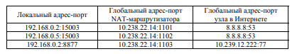

# NAT, sNat, dNat, один к одному, один к многим. masquerade.

## NAT и NAPT

**NAT** (Network Address Translation) — технология трансляции сетевых адресов - это метод, который позволяет изменять IP-адреса в заголовках пакетов, проходящих через маршрутизатор или брандмауэр. 
* это технология, позволяющая преобразовывать внутренние (приватные) IP-адреса во внешние (публичные) и наоборот

Основная цель NAT — решить проблему дефицита публичных IP-адресов и повысить безопасность локальных сетей, скрывая их внутренние адреса от внешнего мира.

С увеличением числа устройств, подключенных к Интернету, количество доступных публичных IP-адресов становится ограниченным. NAT позволяет многим устройствам в локальной сети использовать один или несколько публичных адресов для доступа к Интернету. Это достигается за счет преобразования частных IP-адресов в публичные при выходе в сеть и обратно при входящих соединениях.

Трансляция может быть
* статической, определяемой администратором
* динамической, когда у NAT-маршрутизатора есть пул глобальных адресов, автоматически используемых для сопоставления локальным адресам по мере необходимости


Принцип работы
1. Трансляция адресов:
    * Когда устройство из локальной сети отправляет запрос в Интернет, NAT заменяет его внутренний IP-адрес на внешний публичный IP-адрес.
    * Когда ответ приходит на публичный адрес, NAT использует таблицу трансляций для замены публичного адреса на соответствующий внутренний адрес и отправляет пакет обратно в локальную сеть.
2. Таблица трансляций:
    * NAT ведет таблицу соответствий между внутренними и внешними адресами, чтобы знать, куда отправлять ответные пакеты.
    * Динамический NAT использует пул публичных IP-адресов для сопоставления с внутренними адресами. Когда устройство из локальной сети инициирует соединение, динамический NAT выбирает доступный публичный адрес из пула и использует его для трансляции.
    * Статический NAT использует принцип, где каждый внутренний (приватный) IP-адрес сопоставляется с одним публичным IP-адресом. Это сопоставление фиксировано и не меняется.

**NAPT** (Network Address Port Translation или перегруженный NAT) — это разновидность NAT, которая позволяет нескольким устройствам с уникальными локальными адресами использовать один глобальный IP-адрес, добавляя к каждому соединению уникальный номер порта.

Принципы работы NAPT
1. Преобразование IP и порта:
    * При отправке пакета NAPT заменяет как внутренний IP-адрес, так и номер порта на внешний IP-адрес и уникальный номер порта.
    * Это позволяет маршрутизатору различать соединения от разных устройств внутри одной локальной сети.
2. Таблица сопоставлений:
    * NAPT создает таблицу сопоставлений, где хранятся пары: внутренний IP-адрес + внутренний порт ↔ внешний IP-адрес + внешний порт.
    * Это позволяет маршрутизатору правильно направлять ответные пакеты обратно к соответствующим устройствам.



Как видно из таблицы, при таком принципе работы NAT сопоставляет и
транслирует не только IP-адрес, но и порт. Это делается для того, чтобы избежать случаев, когда с двух сетевых устройств одновременно отправляются пакеты с использованием одного порта (см. первую и вторую строки таблицы).
Подобная реализация позволяет динамически обеспечить общение с нескольких IP-адресов, используя один внешний IP-адрес. Такой принцип использует Masquerade. Также с помощью принципа «многие к одному» можно
настроить доступ извне локальной сети к двум ее сервисам по одному IP-адресу, настроив трансляцию по специально заданным вручную портам. Это
позволит лучше использовать пространство белых IP-адресов и не покупать
дополнительные.

## Один ко многим, один к одному

Один к одному (One-to-One):
* одному внутреннему сопоставляется один внешний адрес

Один ко многим (One-to-Many):
* NAPT (или перегруженный NAT) реализует сопоставление "один ко многим", где множество локальных (приватных) адресов отображаются на один внешний IP-адрес с различными номерами портов. Это позволяет экономить публичные IP-адреса и эффективно использовать их для доступа к Интернету.
* одному внешнему сопоставляется один внутренний (ну или наоборот). смысл в том, что с помощью использования портов (ну или другой информации, но мы про порты проходили) экономятся IP-адреса

## dNAT, sNAT

**SNAT** (Source Network Address Translation):
* Определение: SNAT изменяет адрес источника пакета, когда он покидает локальную сеть. Это позволяет устройствам с частными IP-адресами выходить в Интернет, используя один или несколько публичных IP-адресов.
* Применение: Обычно используется для маскировки внутренних (приватных) адресов, когда устройства внутри сети инициируют соединение с внешним миром. Например, когда компьютер с локальным адресом 192.168.1.2 отправляет запрос в Интернет, маршрутизатор заменяет его адрес на свой внешний IP-адрес.
* Запись в iptables: Пример правила SNAT в iptables:
   ```bash
   iptables -t nat -A POSTROUTING -o ens33 -j SNAT --to-source 198.51.100.1
   ```
* Преимущества: Позволяет скрыть внутренние адреса и использовать один публичный адрес для нескольких устройств.


**DNAT** (Destination Network Address Translation):
* Определение: DNAT изменяет адрес назначения пакета, когда он поступает в локальную сеть. Это позволяет внешним пользователям обращаться к устройствам внутри частной сети.
* Применение: Широко используется для проброса портов и доступа к серверам из Интернета. Например, если внешний запрос поступает на IP-адрес маршрутизатора на порту 80, DNAT может перенаправить этот запрос на внутренний сервер с IP-адресом 192.168.1.10.
* Запись в iptables: Пример правила DNAT в iptables:
   ```bash
   iptables -t nat -A PREROUTING -i ens33 -p tcp --dport 3389 -j DNAT --to-destination 192.168.100.1
   ```
* Преимущества: Позволяет пользователям из Интернета получать доступ к внутренним ресурсам сети.


## masquerade

**Маскарадинг** — это специфический тип трансляции сетевых адресов (NAT), который позволяет скрывать внутренние IP-адреса и использовать один публичный IP-адрес для доступа к Интернету несколькими устройствами в локальной сети. Этот метод особенно полезен в сценариях, где внешний IP-адрес может изменяться, например, при использовании динамических адресов от интернет-провайдера.

Этот метод особенно полезен в сценариях, где внешний IP-адрес может изменяться, например, при использовании динамических адресов от интернет-провайдера.

Как происходит запоминание и замена адресов
1. Запоминание соответствий:
   * Когда устройство в локальной сети отправляет пакет в Интернет, маршрутизатор выполняет замену внутреннего IP-адреса на свой внешний IP-адрес. При этом создается запись в таблице трансляций NAT, которая хранит информацию о текущем соединении.
   * Запись включает:
      * Внутренний IP-адрес устройства.
      * Внутренний порт (если используется).
      * Внешний IP-адрес маршрутизатора.
      * Внешний порт (если используется).
2. Замена адреса:
   * При отправке пакета маршрутизатор заменяет адрес отправителя в заголовке пакета на свой внешний адрес. Например, если устройство с IP-адресом 192.168.1.2 отправляет пакет, маршрутизатор заменяет его на 203.0.113.1.
3. Обратная трансляция:
   * Когда ответ приходит на внешний IP-адрес маршрутизатора, он использует таблицу трансляций для определения, какому внутреннему адресу следует отправить этот ответ.

При использовании маскарадинга сопоставление может происходить как по внутренним портам, так и без них:
* Если используется несколько соединений от разных устройств, маскарадинг запоминает каждое соединение по комбинации внутреннего IP-адреса и порта вместе с внешним IP-адресом и портом.
* Например, если устройство 192.168.1.2 использует порт 5000 для соединения с внешним сервером через порт 80, то запись в таблице может выглядеть так:
  * Внутренний IP: 192.168.1.2:5000 -> Внешний IP: 203.0.113.1:30000
* Таким образом, несколько устройств могут одновременно использовать один публичный IP-адрес благодаря уникальным номерам портов для каждого соединения.


Команды через iptables для маскарадинга
```bash
iptables -t nat -A POSTROUTING -o eth0 -j MASQUERADE
```
* -t nat: Указывает на использование таблицы NAT.
* -A POSTROUTING: Добавляет правило в цепочку POSTROUTING, которая обрабатывает пакеты перед их выходом из интерфейса.
* -o eth0: Указывает выходной интерфейс (в данном случае eth0 — это внешний интерфейс).
* -j MASQUERADE: Указывает действие — применить маскарадинг.
