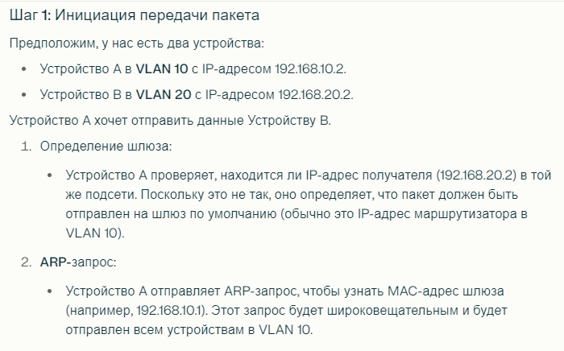
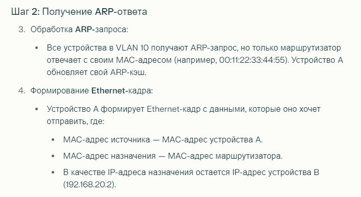
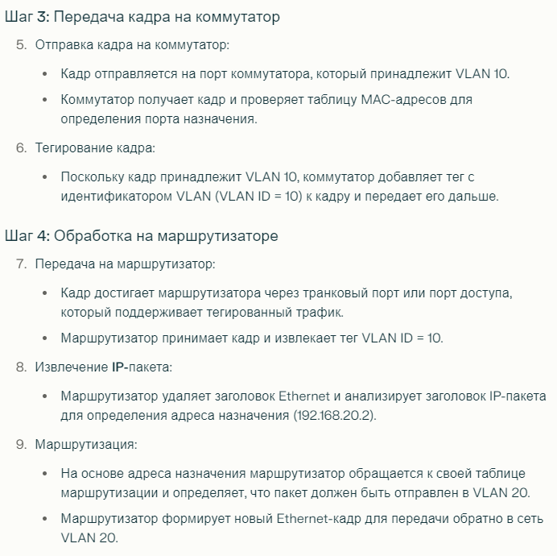
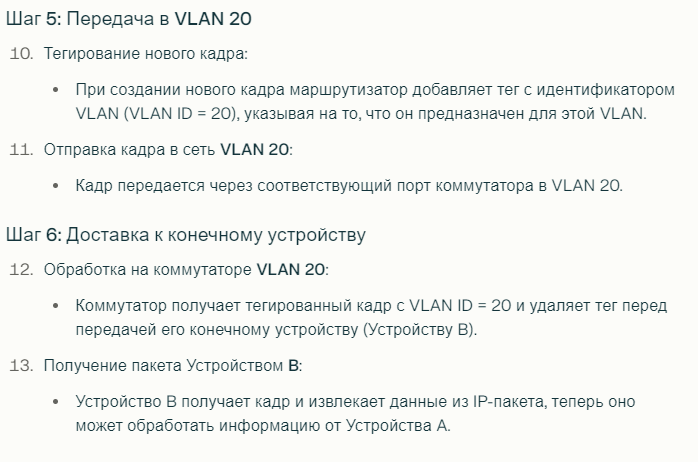

# VLAN, ID, типы. заголовки

**VLAN** - виртуальная локальная сеть - логическая группа узлов сети, трафик которой, в том числе широковещательный, полностью изолирован от других узлов сети на канальном уровне.
* нельзя передать кадры между разными виртуальными сетями на основании MAC-адреса

Преимущества:
* гибкость внедрения 
* ограничение распространения широковещательного трафика -> растет производительность сети, потому что меньше нагружаем
* повышение безопасности сети

Можно настраивать:
* на уровне сетевых узлов
  * настраиваются на коммутаторах и маршрутизаторах
  * не настраиваются на ПК отдельных и подобных
  * на коммутаторах настройки для групп портов. Типа группа портов к одному VLAN ID, другая группа к другому
  * при проходе данных от ПК к коммутатору пакеты тегируются
* на уровне каждого ПК
  * ПК, оргтехника и тд
  * на узле добавляется доп. виртуальный интерфейс, который подключается к физической сети через существующий сетевой интерфейс

Пакеты **тегируются** - дополнительно маркируются информацией о VLAN.
* Стандарт IEEE 802.1Q определяет процедуру передачи трафика VLAN и включает механизм тегирования Ethernet-кадров. При использовании этого стандарта к кадрам добавляется дополнительный заголовок с информацией о VLAN ID.

Каждая VLAN имеет уникальный идентификатор, называемый **VLAN ID**
* 1-4095 число
* VLAN ID = 0 используется для обозначения "не тегированного" трафика. Это значит, что кадры с таким идентификатором не имеют явного тега VLAN и обрабатываются как обычные Ethernet-кадры

**VLAN симметричная** - VLAN, все порты которой пропускают и входящий, и исходящий трафик этой VLAN.

**VLAN асимметричная** - VLAN, в которой есть порты, пропускающие входящий, но не исходящий трафик этой VLAN, и/или есть порты, пропускающие исходящий, но не входящий трафик этой VLAN.

## Заголовки

Стандарт IEEE 802.1Q

**Тег** - 4 байта, добавляемые в каждый кадр трафика

Поля тега:
* Tag Protocol ID = 16 бит
  * что за протокол для тегирования
  * у 802.1Q поле = 0x8100
* Priority = 3 бита
  * то есть 0-7 число
  * чем меньше число, тем выше приоритет
* Canonical Format ID = 1 бит
  * Формат MAC-адреса
  * 0 - канонический
  * 1 - не канонический
* VLAN ID = 12 бит
  * число 0-4095

## Типы 

* со статическим назначением портов (port-based VLAN)
* с динамическим назначением портов

### Статический (port-based VLAN)

Принадлежность трафика к той или иной VLAN определяется по физическому порту, через который был получен этот трафик

Он считается принадлежащим той VLAN, номер которой указан в настройках порта

Содержимое трафика не используется для определения принадлежности трафика к VLAN

Если надо между устройствами передавать трафик нескольких VLAN, то надо выделять отдельный физический канал для каждой VLAN

Port-based еще:
* разбиваем порты коммутатора на группы и запрещаем обмен трафика между группами портов
* у порта 
  * PVID (Port VLAN ID)
  * список VID - номера VLAN, входящих в порт
* в симметричных port-based у порта один VID=PVID
* схема
  1. входящий в коммутатор трафик получает метку PVID внутри коммутатора
  2. если у порта назначен VID, равный метке трафика, то все супер, пропускаем, метку PVID снимаем

От перплексити:
* Описание: Этот тип VLAN группирует устройства по физическим портам коммутатора. Каждый порт на коммутаторе может быть настроен для принадлежности к определенной VLAN.
* Применение: Устройства, подключенные к порту, который принадлежит определенной VLAN, будут находиться в одном широковещательном домене. Это позволяет легко управлять доступом и трафиком.
* Преимущества: Простота настройки и управления, особенно в небольших сетях.

### Динамический

Содержимое трафика влияет на определение принадлежности трафика к той или иной VLAN

Через один порт можно передавать трафик нескольких VLAN

Преимущество - можно пользователю менять местоположение, подключаясь через разные порты

Есть несколько типов динамических:
* Tag-based
  * инфа о принадлежности передается в явном виде
  * в каждом фрейме трафика есть тег с номером VLAN
* MAC-based
  * принадлежность к VLAN основывается на MAC-адресе подключенной рабочей станции
  * У коммутатора таблица MAC-адресов с VLANами
* Authentication-based
  * по данным аутентификации пользователя или устройства мб перемещены во VLAN
* Protocol-based
  * данные 3-4 уровня (3 сетевой, 4 транспортный) в заголовке пакета используются для определения членства во VLAN
  * Например
    * IP -> 1 VLAN
    * IPX -> 2 VLAN
* Subnet-based
  * членство во VLAN основано на IP-адресе и маске подсети рабочей станции
  * Например, устройства с IP-адресами 192.168.1.1 и 192.168.1.2 с маской 255.255.255.0 будут принадлежать одной VLAN, а устройства с адресами 192.168.2.1 и 192.168.2.2 с той же маской будут находиться в другой VLAN.
  
## Тегирующие и нетегирующие порты коммутаторов

**Нетегирующие порты** - access ports - порты коммутаторов, принимающие и отправляющие нетегированный трафик
* они предназначены для подключения конечных устройств (комп, принтер вся фигня)
* работают в рамках одной VLAN и не обрабатывают тегированный трафик
* принадлежат только одной VLAN. На пришедший трафик ставит PVID метку, а с исходящего снимает метку VID=PVID
* пример
  * Если порт настроен как нетегирующий и принадлежит VLAN 10, все кадры, приходящие на этот порт от устройства, будут автоматически тегироваться как VLAN 10. При отправке обратно к устройству тег будет удален.

**Тегирующие порты** - trunk ports - порты, принимающие и отправляющие тегированный трафик
* предназначены для передачи трафика нескольких VLAN через один физический интерфейс. 
* они используются для соединения между коммутаторами или между коммутатором и маршрутизатором.
* может принадлежать нескольким VLAN
* не меняют метки
* Пропускают трафик любых или нескольких VLAN
* Пример
  * Если два коммутатора соединены через тегирующий порт, они могут обмениваться трафиком нескольких VLAN без необходимости создания отдельных физических соединений для каждой VLAN.

**Гибридные порты** - hybrid ports 
* могут передавать как тегированный, так и нетегированный трафик. 
* Они могут обрабатывать трафик из нескольких VLAN и также могут быть настроены на работу с определенной VLAN по умолчанию
* Если кадр без тега поступает на гибридный порт, ему присваивается тег в соответствии с настроенной VLAN по умолчанию. Если кадр уже имеет тег, он будет передан дальше без изменений.
* Гибридные порты полезны в сценариях, где необходимо поддерживать совместимость с устройствами, которые не поддерживают тегирование.

## Маршрутизация между VLAN-сетями

### По методе

Каждая VLAN - сегмент сети. Узлы VLAN обычно в одной IP-подсети.

Связь между узлами из разных VLAN через маршрутизатор, подключенный к этим VLAN

Если маршрутизатор подключен к нетегирующим портам, то он может не поддерживать тегированный трафик.

Если маршрутизатор подключен к тегирующим портам, то тегированный трафик поддерживается.

На каждом физическом интерфейе (порту) может быть множество виртуальных интерфейсов со своим тегом у трафика.
* есть тег 2
* физически он идет через eth0
* логически через eth0/2

Почему трафик не блокируется?
1. Тегирование и маршрутизация:
   * Трафик не блокируется между VLAN благодаря тегированию кадров с помощью стандартов IEEE 802.1Q, которое позволяет идентифицировать принадлежность пакетов к определенным VLAN.
2. Маршрутизация через шлюз:
   * Поскольку устройства в разных VLAN не могут общаться напрямую, они используют маршрутизатор как шлюз по умолчанию для передачи данных между сетями.
3. Коммутаторы и таблицы MAC-адресов:
   * Коммутаторы управляют трафиком на основе таблиц MAC-адресов и настроек портов, что позволяет им правильно направлять пакеты без нарушения изоляции между VLAN.

