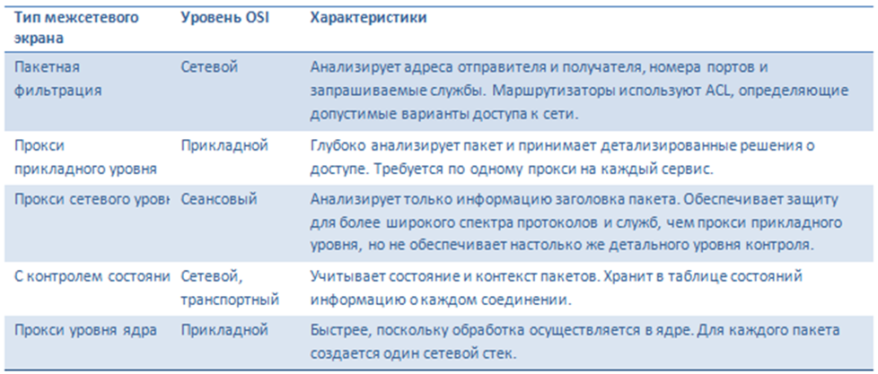

# Межсетевые экраны. Местоположение. Разделение по уровням анализа. stateless, statefull. Преимущества, недостатки и тп. iptables, цепочки, принцип работы


## Межсетевые экраны. Местоположение. Разделение по уровням анализа. stateless, statefull. Преимущества, недостатки и тп.

**Межсетевой экран** (МСЭ) — это устройство обеспечения безопасности сети, которое осуществляет мониторинг входящего и исходящего сетевого трафика и на основании установленного набора правил безопасности принимает решения, пропустить или блокировать конкретный трафик

Есть несколько подходов:
* можно все, что не запрещено
* нельзя все, что явно не разрешено

Есть:
* аппаратные
  * Это отдельные устройства, которые устанавливаются между сетью и интернетом. Они обеспечивают защиту всей сети и могут обрабатывать большой объем трафика.
* программные
  * Это программные решения, которые устанавливаются на серверах или рабочих станциях. Они обеспечивают защиту на уровне отдельных устройств
* смешанного типа
  * Сочетают в себе функции аппаратных и программных решений. Например, некоторые устройства могут иметь встроенное программное обеспечение для управления фильтрацией трафика

По **местоположению** есть:
* host-based
  * располагается на самой системе, где надо фильтровать трафик
  * настраиваем трафик на конкретном компьютере
  * линии связи в большей степени без защиты (клммутаторы и тд) -> отсутствие доступа к узлам при атаках на узлы
* network-based
  * на промежуточных узлах сети между защищаемыми ресурсами и др. узлами
  * централизованное администрирование сетевого экрана всех узлов внутренней сети
  * длительность запросов растет, нагрузка растет, так как на обработку всего проходящего трафика тратимся
  * Фильтрация трафика: Проверка сетевых пакетов на основе заданных правил, таких как IP-адреса, порты, протоколы и другие параметры.
  * Контроль доступа: Блокировка или разрешение трафика в соответствии с правилами.
  * Защита сети: Предотвращение несанкционированного доступа, атак (DoS, DDoS, сканирование портов и др.).
  * NAT (Network Address Translation): Преобразование частных IP-адресов во внешние публичные IP-адреса для выхода в интернет.
  * VPN (Virtual Private Network): Создание безопасных туннелей для удаленного доступа.
  * Журналирование и аудит: Запись событий и трафика для мониторинга и анализа.
  * IDS/IPS (Intrusion Detection/Prevention System): Обнаружение и предотвращение вторжений.
  * Типы Network-based межсетевых экранов:
    * Packet Filtering Firewalls (межсетевые экраны с фильтрацией пакетов): Проверяют заголовки пакетов на основе заданных правил (IP-адреса, порты, протоколы).
    * Stateful Inspection Firewalls (межсетевые экраны с отслеживанием состояния): Отслеживают состояние соединений, что позволяет более эффективно проверять трафик.
    * Proxy Firewalls (прокси-межсетевые экраны): Выступают посредником между клиентами и серверами, проверяя трафик на уровне приложений.
    * Next-Generation Firewalls (межсетевые экраны следующего поколения, NGFW): Объединяют функции межсетевых экранов с отслеживанием состояния, IPS и другими функциями.
* proxy server (по сути тоже network история)
  * +1 вариант использования сетевого экрана как промежуточной точки между защищаемой сетью и внешней сетью
  * это сетевой экран, обеспечивающий анализ данных и фильтрацию вредоносного трафика
  * трафик перед получением его защищаемым узлом перенаправляется на специальный узел 
  * это тип межсетевого экрана, который действует как посредник между пользователями внутренней сети и внешними серверами или ресурсами. В отличие от других типов межсетевых экранов, которые анализируют пакеты на уровне сети, прокси межсетевой экран работает на уровне приложения. Он принимает запросы от пользователей, анализирует их и, при необходимости, перенаправляет их к внешнему ресурсу. Затем прокси получает ответ от внешнего ресурса и перенаправляет его пользователю.
  * Основные характеристики Прокси Межсетевых экранов:
    * Посредничество: Прокси-сервер выступает посредником между клиентами и серверами, обрабатывая все запросы от клиентов и отвечая на них.
    * Уровень приложения: Работает на уровне приложений (например, HTTP, HTTPS, FTP), анализируя содержимое запросов и ответов.
    * Маскировка: Скрывает внутреннюю структуру сети, предоставляя только свой IP-адрес для внешнего мира.
    * Кэширование: Может кэшировать часто используемые ресурсы (например, веб-страницы), что повышает скорость доступа.
    * Фильтрация контента: Позволяет блокировать доступ к определенным сайтам или ресурсам на основе URL-адресов или содержимого.
    * Логирование: Записывает все запросы и ответы для мониторинга и аудита.
  * Принципы работы Прокси Межсетевых Экранов:
    1. Перехват запроса: Клиент (например, веб-браузер) отправляет запрос на прокси-сервер, вместо того чтобы отправлять его напрямую на внешний сервер.
    2. Анализ запроса: Прокси-сервер анализирует запрос, проверяя его на соответствие правилам (например, наличие вредоносного содержимого, URL-адреса в черном списке).
    3. Перенаправление запроса (при необходимости): Если запрос удовлетворяет правилам, прокси-сервер перенаправляет его на внешний сервер.
    4. Получение ответа: Прокси-сервер получает ответ от внешнего сервера.
    5. Анализ ответа: Прокси-сервер анализирует ответ, также проверяя его на соответствие правилам (например, наличие вредоносного содержимого).
    6. Перенаправление ответа клиенту: Если ответ удовлетворяет правилам, прокси-сервер перенаправляет его клиенту.


МСЭ могут работать на разных уровнях




### Разделение по уровням анализа 

### Фильтрация на сетевом уровне
* фильтруем по информации из заголовков TCP- и IP-пакетов
  * IP-адрес отправителя
  * IP-адрес получателя
  * порт отправителя
  * порт получателя

Плюсы
  * сравнительно невысокая стоимость
  * гибкость в определении правил фильтрации
  * небольшая задержка при прохождении пакетов 

Минусы
  * не могут анализировать фрагментированные пакеты
  * не отслеживает взаимосвязь между пакетами

Есть тут деление по отслеживанию активных соединений
  * **stateless** (простая фильтрация)
    * фильтруют потоки данных на основе статических данных о пакете (IP-адреса, порты и протоколы)
    * то есть не отслеживают текущие соединения (например, TCP)
    * Каждое соединение рассматривается независимо, без учета предыдущих пакетов.
    * принцип работы
      1. При получении пакета межсетевой экран проверяет его заголовок против заранее определенных правил.
      2. Если пакет соответствует правилам, он пропускается; если нет — блокируется.
    * Скорость и эффективность: Поскольку не требуется отслеживание состояния соединений, такие экраны быстрее обрабатывают пакеты и требуют меньше ресурсов.
    * Простота настройки: Настройка правил для статических межсетевых экранов проще, так как они не требуют сложной конфигурации.
    * Ограниченная безопасность: Не могут обнаруживать сложные атаки, которые используют легитимные пакеты, так как не учитывают контекст соединения.
    * Не могут анализировать фрагментированные пакеты: Если пакет был фрагментирован, его анализ может быть затруднен.
  * **stateful**, stateful packet inspection (SPI) (фильтрация с четом контекста)
    * анализ логики работы протоколов и приложений
    * отслеживание текущих соединений и пропуском только таких пакетов, которые удовлетворяют логике и алгоритмам работы соответствующих протоколов и приложений
    * Они используют таблицу состояния для хранения информации о каждом активном соединении.
    * Принципы работы:
      1. Когда пакет поступает, межсетевой экран проверяет его заголовок и сопоставляет его с записями в таблице состояния.
      2. Если пакет является частью существующего соединения, он пропускается; если это новое соединение, оно проверяется по правилам безопасности.
    * Улучшенная безопасность: Stateful firewalls могут обнаруживать и блокировать атаки, которые используют легитимные пакеты, так как они понимают контекст соединения.
    * Динамическое управление правилами: Могут динамически создавать и удалять правила на основе состояния соединений.
    * Более высокая нагрузка на ресурсы: Поддержание таблицы состояния требует больше памяти и вычислительных ресурсов.
    * Сложность конфигурации: Настройка stateful firewalls может быть более сложной из-за необходимости управления состоянием соединений.

### Фильтрация на прикладном уровне

С целью защиты ряда уязвимых мест, присущих фильтрации пакетов, межсетевые экраны должны использовать прикладные программы для фильтрации соединений с такими сервисами, как, например, Telnet, HTTP, FTP.

Подобное приложение называется **proxy-службой**, а хост, на котором работает proxy-служба – шлюзом уровня приложений. Такой шлюз исключает прямое взаимодействие между авторизованным клиентом и внешним хостом


Плюсы:
* простые правила фильтрации
  * Например, администраторы могут блокировать доступ к определенным URL-адресам или типам файлов.
* возможность организации большого числа проверок. Защита на уровне приложений позволяет осуществлять большое количество дополнительных проверок, что снижает вероятность взлома с использованием "дыр" в программном обеспечении;
  * Межсетевые экраны прикладного уровня могут выполнять множество дополнительных проверок. Это снижает вероятность взлома через уязвимости в программном обеспечении, так как они могут анализировать содержимое пакетов и выявлять подозрительные действия (например, попытки передачи вредоносных файлов).
* способность анализировать данные приложений.
  * Такие межсетевые экраны могут анализировать не только заголовки, но и тело пакета, что позволяет им выявлять нежелательный или вредоносный контент. Например, они могут блокировать сообщения с подозрительными вложениями или команды, которые не соответствуют логике работы протокола.


Минусы:
* относительно низкая производительность по сравнению с фильтрацией пакетов
* proxy должен понимать свой протокол 
  * Межсетевой экран прикладного уровня должен быть настроен для работы с конкретными протоколами. Если он не знает о каком-либо новом или нестандартном протоколе, он не сможет корректно обработать трафик этого протокола.
* Сложная операционная система
  * Межсетевые экраны прикладного уровня часто работают под управлением сложных операционных систем, что может усложнить их настройку и обслуживание


## iptables, цепочки, принцип работы

**iptables** - утилита для управления межсетевым экраном

Создаем правила, которые управляют фильтрацией и перенаправлением пакетов

Все управление от суперпользователя происходит

Есть 3 основных понятия:
1. **Правило** = критерий + действие + счетчик
   * критерий - это типа условие, при котором действие делаем. анализирует свойство пакета
   * действие это действие. тут очевидно. определяет, что нужно сделать
   * счетчик учитывает, что пакет подошел под критерий. и учитывает также суммарный объем пакетов в байтах (подходящих под критерий)
2. **Цепочка** - упорядоченная последовательность правил
   * правила срабатывают в порядке их указания -> важен порядок при настройке
   * есть 5 типов базовых цепочек
     * PREROUTING - для изначальной обработки пакетов входящих
     * INPUT - для входящих пакетов, адресованных непосредственно локальному процессу (клиенту или серверу)
     * FORWARD - для входящих пакетов, перенаправленных на выход
     * OUTPUT - для пакетов, генерируемых локальными процессами
     * POSTROUTING - для окончательной обработки исходящих процессов
   * можно создавать дополнительные пользовательские цепочки
3. **Таблица** - совокупность базовых и пользовательских цепочек, объединенных общим функциональным назначением
   * имена таблиц в нижнем регистре, чтобы не конфликтовать с именами пользовательских цепочек
   * цепочки организованы в 4 таблицы:
    * raw - просматривается до передачи пакета системе определения состояний
      * редко используется
      * пример: маркировка пакетов, которые НЕ должны обрабатываться системой определения состояний (действие NOTRACK)
      * PREROUTING, OUTPUT
    * mangle - правила модификации IP-пакетов (обычно заголовков)
      * поддерживает действия TTL (time to live), TOS (type of service), MARK (изменение полей TTL, TOs и маркеров пакета)
      * все цепочки (PREROUTING, INPUT, OUTPUT, FORWARD, POSTROUTING)
    * nat - просматривает пакеты, создающие новое соединение (согласно системе определения состояний)
      * предназначена для подмены адреса отправителя или получателя. Данную таблицу проходят только первый пакет из потока, трансляция адресов или маскировка (подмена адреса отправителя или получателя) применяются ко всем последующим пакетам в потоке автоматически.
      * действия DNAT, SNAT, MASQUERADE, REDIRECT
      * PREROUTING, OUTPUT, POSTROUTING
    * filter - основная таблица. Используется по умолчанию
    * INPUT, FORWARD, OUTPUT


### Примеры использования, действия и все такое


Вывести все правила

```bash
iptables -L
```

Вывести правила таблицы

```bash
iptables -t nat -L
```

Очистить таблицу

```bash
iptables -F  # Очищает все цепочки в таблице filter (по умолчанию)
iptables -t nat -F  # Очищает все цепочки в таблице nat
```

Удаление всех пользовательских цепочек

```bash
iptables -X
```

Действия:
* ACCEPT: Разрешить пакет.
* DROP: Отбросить пакет без уведомления отправителя.
* REJECT: Отбросить пакет с уведомлением отправителя.
* LOG: Записать информацию о пакете в системный журнал.
* RETURN: Вернуться к предыдущему правилу в цепочке.
* QUEUE: Отправляет пакет в очередь для дальнейшей обработки сторонним приложением (например, пользовательским приложением или программой).
* DNAT (Destination NAT): Изменяет адрес назначения пакета. Это используется для перенаправления трафика на другой IP-адрес.
* SNAT (Source NAT): Изменяет адрес источника пакета. Это часто используется при выходе трафика из локальной сети в интернет.
* MASQUERADE: Специфический вид SNAT, который автоматически подставляет внешний IP-адрес интерфейса при изменении адреса источника пакета. Используется для динамических IP-адресов.
* MARK: Устанавливает маркер для пакета, который может использоваться для дальнейшей обработки или маршрутизации.
* TOS (Type of Service): Устанавливает поле TOS в заголовке IP-пакета, что может использоваться для управления приоритетом трафика.
* TTL (Time to Live): Изменяет значение поля TTL в заголовке IP-пакета, что может использоваться для управления временем жизни пакета в сети.


Примеры добавления цепочек

Разрешить входящий трафик на порт 80 (HTTP)
```bash
iptables -A INPUT -p tcp --dport 80 -j ACCEPT
```

Заблокировать IP-адрес 192.168.1.100
```bash
iptables -A INPUT -s 192.168.1.100 -j DROP
```

Отклонить входящие соединения с уведомлением:
```bash
iptables -A INPUT -s 192.168.1.100 -j REJECT
```

Логировать все входящие пакеты:
```bash
iptables -A INPUT -j LOG --log-prefix "Incoming packet: "
```

Перенаправить трафик с порта 80 на порт 8080 на том же устройстве:
```bash
iptables -t nat -A PREROUTING -p tcp --dport 80 -j REDIRECT --to-port 8080
```

если ты хочешь, чтобы уб1 принимал пакеты только с уб3, а остальные отбрасывал, то команда для уб1 следующая:
```bash
iptables -A OUTPUT ! -d <IP-адрес уб3> -j DROP
```


