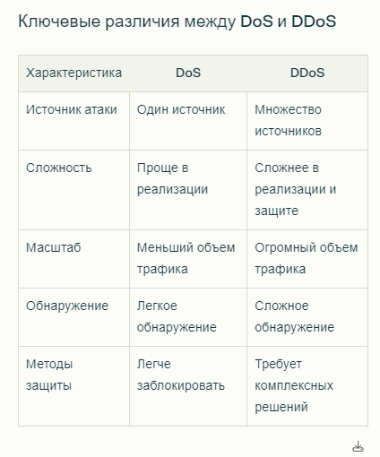
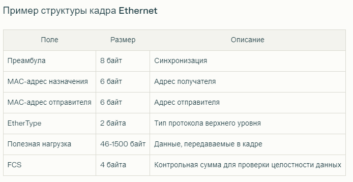

# DDoS, VPN, выход в сеть

## DoS, DDoS

**Триада** ЦРУ (CIA Triad) — это основополагающая концепция в области информационной безопасности, которая включает три ключевых компонента: Конфиденциальность, Целостность и Доступность. Эти три элемента служат основой для разработки стратегий и политик безопасности данных и систем.
1. Конфиденциальность
   * Определение: Конфиденциальность обеспечивает защиту информации от несанкционированного доступа. Это означает, что только уполномоченные пользователи могут получить доступ к конфиденциальным данным.
   * Методы обеспечения конфиденциальности:
     * Шифрование: Преобразование данных в нечитаемый формат, который может быть расшифрован только с использованием специального ключа.
     * Контроль доступа: Установка прав доступа к данным на основе ролей пользователей.
     * Аутентификация: Процесс проверки идентификации пользователя (например, с помощью паролей, биометрии).
2. Целостность
   * Определение: Целостность гарантирует, что данные остаются точными и неизменными в процессе хранения и передачи. Это означает, что информация не должна быть подвержена несанкционированным изменениям.
   * Методы обеспечения целостности:
     * Контрольные суммы и хеширование: Использование алгоритмов для проверки целостности данных.
     * Цифровые подписи: Подтверждение подлинности и целостности данных с помощью криптографических методов.
     * Аудит и мониторинг изменений: Регулярная проверка данных на предмет изменений и ведение журналов изменений.
3. Доступность
   * Определение: Доступность гарантирует, что уполномоченные пользователи могут получить доступ к информации и ресурсам по мере необходимости. Это включает в себя защиту от атак, которые могут привести к недоступности систем или данных.
   * Методы обеспечения доступности:
     * Резервное копирование данных: Регулярное создание резервных копий для восстановления информации в случае потери.
     * Устойчивость к сбоям: Использование избыточных систем и компонентов для минимизации времени простоя.
     * Защита от DDoS-атак: Механизмы защиты, предотвращающие перегрузку серверов.


**DoS** (Denial of Service) и **DDoS** (Distributed Denial of Service) — это типы кибератак, направленные на отказ в обслуживании, которые перегружают сервер или сеть, делая их недоступными для пользователей.



### Классификация DoS и DDoS-атак

Активные атаки
* Определение: Эти атаки изменяют состояние системы или сети, например, путем перегрузки ресурсов.
* Примеры:
    * DDoS: Использование ботнетов для создания огромного объема трафика к целевому серверу.
    * Вирусы: Вредоносное ПО, которое может также инициировать DoS-атаки.

Пассивные атаки
* Определение: Эти атаки не нарушают работу системы, а лишь перехватывают данные.
* Примеры:
    * Перехват трафика для анализа данных без изменения состояния системы.

### Основные типы атак

1. SYN Flood
    * Описание: Атака, при которой злоумышленник отправляет множество SYN-запросов для установления TCP-соединения, но не завершает их. Это приводит к исчерпанию ресурсов сервера.
2. UDP Flood
    * Описание: Злоумышленник отправляет большое количество UDP-пакетов на случайные порты целевого устройства, что вызывает перегрузку.
3. ICMP Flood
    * Описание: Использует ICMP-запросы (например, ping) для перегрузки сети. Сервер отвечает на каждый запрос, что создает дополнительную нагрузку.
4. Smurf Attack
    * Описание: Злоумышленник отправляет ICMP-запросы на широковещательные адреса с подмененным IP-адресом жертвы. Все устройства в сети отвечают на запросы, создавая огромный трафик к жертве.
5. DNS Amplification
    * Описание: Использует уязвимости публичных DNS-серверов для отправки большого объема данных на целевой сервер. Запрос формируется так, чтобы ответ был значительно больше по размеру.
6. HTTP Flood
    * Описание: Атака на уровень приложений (L7), где злоумышленник отправляет множество HTTP-запросов к веб-серверу, чтобы исчерпать его ресурсы.

### Механизмы атак

1. IP Spoofing
    * Описание: Подмена IP-адреса отправителя в пакете данных для маскировки истинного источника атаки.
2. Брутфорс
    * Описание: Метод перебора паролей или ключей для доступа к системе или ресурсам.
3. Перенаправление трафика
    * Описание: Перенаправление легитимного трафика на сервер-жертву с целью перегрузить его ресурсами.


### DDoS по уровням OSI 

Физический:
* ICMP Flood 
  * Злоумышленники отправляют большое количество ICMP-запросов (ping), что может перегрузить физическую сеть и снизить её пропускную способность.
* Последствия: Сетевое оборудование может выйти из строя и потребовать ремонта.

Канальный:
* MAC Flooding
  * Атакующий заполняет таблицу MAC-адресов коммутатора, что приводит к его сбоям и потере производительности.

Сетевой:
* SYN Flood: Злоумышленник отправляет множество SYN-запросов для установления TCP-соединений, не завершая их, что приводит к исчерпанию ресурсов сервера.
* Smurf Attack: Использует ICMP-запросы с подменой IP-адреса жертвы, что приводит к перегрузке сети.

Транспортный:
* UDP Flood: Злоумышленник отправляет большое количество UDP-пакетов на случайные порты целевого устройства, вызывая его перегрузку.

Сеансовый:
* Атака на протокол Telnet, где злоумышленник использует уязвимости для получения доступа к серверу.

Уровень представления:
* SSL Flood: Злоумышленники генерируют множество SSL-запросов, что перегружает сервер из-за длительной проверки шифрования.

Прикладной уровень:
* HTTP Flood: Атака на веб-серверы, где злоумышленник отправляет множество HTTP-запросов, чтобы исчерпать ресурсы сервера.

### Подходы к защите

1. Фильтрация трафика: Использование межсетевых экранов для блокировки подозрительного трафика на разных уровнях модели OSI.
2. Мониторинг трафика: Постоянный анализ сетевой активности для выявления аномалий.
3. Распределенные системы защиты: Использование специализированных сервисов для защиты от DDoS-атак, которые могут обрабатывать большой объем трафика.


## VPN (тут не по лекции)

**VPN** (Virtual Private Network) — это технология, которая создает защищенное соединение между вашим устройством и удаленным сервером через общедоступную сеть, такую как Интернет. Это позволяет пользователям безопасно передавать данные и скрывать свою активность в сети.

Основные компоненты VPN
1. VPN-клиент: Программное обеспечение или устройство, которое инициирует соединение с VPN-сервером. Оно может быть установлено на компьютере, смартфоне или роутере.
2. VPN-сервер: Сервер, который принимает соединения от клиентов и обеспечивает доступ к защищенной сети. Он может находиться в другом городе или стране.
3. Туннель: Защищенное соединение между клиентом и сервером, через которое передаются зашифрованные данные.

### Схема работы 

Наааша задача рааазными схемами обмануть эту гребаную ракетку


1. Инициация соединения:
    * Пользователь запускает VPN-клиент и вводит свои учетные данные (логин и пароль).
    * Клиент устанавливает TCP или UDP соединение с VPN-сервером.
2. Аутентификация:
    * После установки соединения происходит аутентификация пользователя на сервере. Сервер проверяет введенные учетные данные и определяет права доступа.
3. Создание туннеля:
    * После успешной аутентификации клиент и сервер создают зашифрованный туннель для передачи данных. Этот туннель защищает данные от перехвата.
4. Шифрование данных:
    * Данные, отправляемые через туннель, шифруются с использованием различных алгоритмов (например, AES). Это делает информацию нечитаемой для третьих лиц.
5. Передача данных:
    * Когда пользователь запрашивает доступ к веб-сайту или ресурсу, запрос отправляется на VPN-сервер через туннель.
    * VPN-сервер обрабатывает запрос и отправляет его на целевой ресурс от своего имени, используя свой IP-адрес.
6. Получение ответа:
    * Ответ от целевого ресурса возвращается на VPN-сервер.
    * Сервер шифрует ответ и отправляет его обратно клиенту через туннель.
    * Клиент расшифровывает полученные данные и отображает их пользователю.


При подключении к VPN происходит _изменение таблицы маршрутизации_ на устройстве пользователя:
* Добавление маршрута: В таблицу маршрутизации добавляется новый маршрут, указывающий, что трафик для определенных адресов (или весь трафик) должен направляться через VPN-туннель.
* Создание виртуального интерфейса: Устройство создает виртуальный сетевой интерфейс (например, tun0 или tap0), который используется для передачи данных через туннель.


Как настроить VPN для доступа только к конкретным ресурсам
Если вы хотите использовать VPN только для доступа к определенным ресурсам (например, к определенным веб-сайтам или сервисам), вам нужно настроить так называемую разделенную маршрутизацию (split tunneling). Вот основные шаги:
1. Настройка VPN-клиента:
    * Многие современные VPN-клиенты поддерживают функцию разделенной маршрутизации. В настройках клиента вы можете указать, какие IP-адреса или домены должны использовать VPN-туннель, а какие — обычное интернет-соединение.
2. Настройка маршрутов:
    * Вы можете вручную добавить маршруты в таблицу маршрутизации вашего устройства для указания конкретных адресов или диапазонов адресов, которые должны проходить через VPN.
    * Например:
    ```bash
    route add <IP-адрес> mask <маска> <IP-адрес-VPN-сервера>
   ```
3. Использование DNS:
    * Если вы хотите использовать DNS для управления доступом к ресурсам, убедитесь, что ваш VPN-клиент настроен на использование DNS-серверов, которые могут разрешать имена хостов для ресурсов, доступных через VPN.
    * Некоторые клиенты могут автоматически перенаправлять DNS-запросы через VPN-сервер.


## Ебаные вопросы. Как понять какой протокол используется

### Вроде в контексте того билета это было про то, используем ли мы TCP или UDP, но я рассмотрю это и глобально

### TCP или UDP??????????????

Как узнать, TCP или UDP: Раскрываем тайны портов с помощью netstat

Иногда возникает необходимость понять, какой протокол – TCP или UDP – используется для соединения с определенным портом. Например, при анализе сетевой активности, диагностике проблем с подключением или просто из любопытства.

Один из самых простых и эффективных способов – использовать команду netstat в командной строке. Она предоставляет обширную информацию о сетевых соединениях, включая протокол, используемый для каждого из них.

Ключевые параметры команды netstat, которые помогут нам разобраться с TCP и UDP:

✅  -l (или --listen) – показывает все прослушиваемые сокеты, то есть порты, которые ожидают входящих подключений.

✅  -t (или --tcp) – выводит информацию только о TCP-соединениях.

✅  -u (или --udp) – выводит информацию только о UDP-соединениях.

Например, если вы хотите увидеть все прослушиваемые TCP-порты, вы можете использовать команду:

```bash

netstat -ltn

```

Результат будет отображать список портов, использующих протокол TCP, а также их состояние (например, LISTEN, ESTABLISHED).

Если же вас интересуют только UDP-соединения, то используйте:

```bash

netstat -lun

```

В этом случае вы увидите список портов, которые используют протокол UDP, и информацию о связанных с ними процессах.

💻 Используя эти простые команды, вы сможете быстро получить представление о том, какие порты и протоколы используются на вашем компьютере. Это поможет вам лучше понять, как работает ваша сеть, и оперативно решить возникающие проблемы.

Важно помнить, что netstat – это мощный инструмент, который может предоставить конфиденциальную информацию о вашей системе. Используйте его с осторожностью и только в тех случаях, когда вы действительно понимаете, что делаете. 🕵️‍♂️


### А если просто??????? хуесто

Чтобы понять, какой протокол использует приложение, можно использовать несколько методов и подходов. Протоколы, такие как TCP, UDP, HTTP, HTTPS, FTP и другие, могут быть обнаружены различными способами. Вот подробное руководство по этому процессу.
1. Проверка документации приложения
   * Первый и самый простой способ — это изучение документации приложения. Разработчики часто указывают используемые протоколы в спецификациях или руководствах пользователя. Это может быть полезно для понимания архитектуры приложения и его сетевых взаимодействий.
2. Анализ URL
   * Если приложение является веб-приложением, вы можете обратить внимание на URL:
     * HTTP: Если URL начинается с http://, это означает использование протокола HTTP (обычно TCP).
     * HTTPS: Если URL начинается с https://, это означает использование протокола HTTPS (TCP с шифрованием).
     * FTP: Если URL начинается с ftp://, это указывает на использование FTP (обычно TCP).
3. Использование сетевых инструментов
   1. Netstat
     * Команда netstat позволяет увидеть активные соединения и порты, используемые приложениями. Например:
     ```bash
     netstat -tuln
     ```
     -t: показывает TCP-соединения.
     -u: показывает UDP-соединения.
     -l: показывает только слушающие порты.
     -n: показывает адреса и порты в числовом формате.
   2. Wireshark
       * Wireshark — это мощный инструмент для анализа сетевого трафика. Он позволяет захватывать пакеты и анализировать их содержимое, что помогает определить, какой протокол используется:
       1. Запустите Wireshark и начните захват трафика.
       2. Фильтруйте трафик по IP-адресу или порту приложения.
       3. Анализируйте заголовки пакетов, чтобы увидеть используемые протоколы (например, TCP или UDP).
   3. Снифферы трафика
     * Инструменты сниффинга, такие как Fiddler, Charles Proxy или Burp Suite, позволяют перехватывать HTTP/HTTPS-запросы и анализировать их:
         * Fiddler: Позволяет перехватывать все HTTP/HTTPS запросы и ответы.
         * Charles Proxy: Поддерживает работу с мобильными устройствами и позволяет расшифровывать HTTPS-трафик.
         * Burp Suite: Используется для тестирования безопасности веб-приложений и анализа трафика.
4. Проверка конфигурационных файлов
   * Многие приложения имеют конфигурационные файлы, где указаны используемые протоколы и порты. Например:
   * Веб-серверы могут иметь настройки для HTTP и HTTPS.
   * Приложения могут иметь конфигурационные файлы с параметрами подключения к базе данных или API.
5. Использование командных утилит
   * Для некоторых приложений можно использовать командные утилиты для проверки протоколов:
   ```bash
   curl -I http://example.com
   ```
   Эта команда покажет заголовки ответа сервера и может указать на используемый протокол.
6. Обратная связь от сервера
   * При взаимодействии с сервером можно отправить запрос и проанализировать ответ. Сервер может вернуть информацию о поддерживаемых протоколах.
7. Мониторинг сетевой активности
   * Используйте инструменты мониторинга сетевой активности для отслеживания трафика между клиентом и сервером. Это может помочь выявить используемые протоколы в реальном времени.
   * Примеры распространенных протоколов
     * HTTP/HTTPS: Используются для веб-приложений.
     * FTP/SFTP: Используются для передачи файлов.
     * SMTP/IMAP/POP3: Используются для электронной почты.
     * DNS: Используется для разрешения доменных имен.


## Выход в сеть (Какие процессы есть, когда мы открываем браузер и вводим сайт от начала отправки пакетов до получения ответа?)

Кратко
1. URL-ввод: Пользователь вводит URL.
2. DNS-запрос: Браузер получает IP-адрес сервера.
3. TCP Handshake: Устанавливается TCP-соединение.
4. HTTP-запрос: Браузер отправляет HTTP-запрос (в случае HTTPS, запрос шифруется).
5. Обработка запроса: Сервер обрабатывает запрос.
6. HTTP-ответ: Сервер отправляет HTTP-ответ (в случае HTTPS, ответ шифруется).
7. Обработка ответа: Браузер обрабатывает HTML, CSS, JavaScript.
8. Отображение страницы: Браузер отображает веб-страницу.
9. TCP Connection close: Закрывается соединение.


Долго

Браузер анализирует URL, определяя протокол (например, http или https), имя хоста (www.example.com) и путь (если есть).
Поиск IP-адреса: Браузер не может напрямую связаться с сервером по имени хоста, поэтому он должен сначала получить IP-адрес сервера, соответствующий доменному имени.
* DNS-запрос: Браузер отправляет DNS-запрос на DNS-сервер.
* Локальный DNS-кэш: Сначала браузер проверяет локальный DNS-кэш (кэш операционной системы). Если IP-адрес найден в кэше, этот шаг пропускается.
* Рекурсивный DNS-запрос: Если IP-адрес не найден в кэше, браузер отправляет рекурсивный запрос на DNS-сервер, указанный в настройках вашей сети.
* Последовательность запросов DNS: DNS-сервер может обращаться к другим DNS-серверам (например, корневым, TLD-серверам и authoritative DNS-серверам), чтобы найти нужный IP-адрес.
* DNS-ответ: DNS-сервер возвращает IP-адрес, соответствующий доменному имени.

Установление TCP-соединения (Three-way handshake)
* Инициация соединения: Браузер теперь имеет IP-адрес сервера и готов к установлению TCP-соединения.
* SYN-пакет: Браузер (клиент) отправляет TCP-пакет с установленным флагом SYN на порт 80 (HTTP) или 443 (HTTPS) сервера (целевой порт определяется протоколом).
* SYN-ACK-пакет: Сервер отвечает TCP-пакетом с флагами SYN и ACK (подтверждение SYN).
* ACK-пакет: Браузер отправляет TCP-пакет с флагом ACK, подтверждая получение SYN-ACK.
  Соединение установлено: После этого трехэтапного "рукопожатия" между браузером и сервером установлено надежное TCP-соединение.

Отправка HTTP/HTTPS-запроса
* Формирование запроса: Браузер формирует HTTP-запрос, который содержит:
* Метод (например, GET для получения ресурса, POST для отправки данных).
* URI (Uniform Resource Identifier, путь к запрашиваемому ресурсу, например, /index.html).
* Заголовки (например, Host, User-Agent, Accept, Cookie и другие).
* Отправка запроса: Браузер отправляет HTTP-запрос в виде TCP-пакетов через установленное TCP-соединение.
* Для HTTPS, запрос шифруется с использованием TLS/SSL (Transport Layer Security / Secure Sockets Layer) после установления TCP-соединения, но до отправки HTTP-запроса.
* Шифрование происходит с помощью TLS/SSL handshake, который включает в себя согласование алгоритма шифрования и обмен сертификатами (если сервер предоставляет сертификат).

Обработка запроса на сервере
* Получение запроса: Веб-сервер (например, Apache, Nginx) получает HTTP-запрос от браузера.
* Обработка запроса:
  Веб-сервер анализирует запрос и определяет, какой ресурс требуется.
  Веб-сервер может обращаться к базе данных или другим ресурсам для получения необходимых данных.
  Веб-сервер формирует HTTP-ответ.

Формирование ответа: Веб-сервер формирует HTTP-ответ, который содержит:
* Статус-код (например, 200 OK для успешного запроса, 404 Not Found если ресурс не найден, 500 Internal Server Error).
* Заголовки (например, Content-Type, Content-Length, Date, Server, Set-Cookie).
* Тело ответа (содержимое запрашиваемого ресурса, например, HTML-код веб-страницы, изображение и т.д.).
* Отправка ответа: Веб-сервер отправляет HTTP-ответ в виде TCP-пакетов через установленное TCP-соединение.
* Для HTTPS, ответ также зашифрован с помощью TLS/SSL.

Получение и обработка ответа браузером
* Получение ответа: Браузер получает TCP-пакеты с HTTP-ответом от сервера.
* Разбор ответа: Браузер анализирует HTTP-ответ:
  Проверяет статус-код.
  Разбирает заголовки.
  Получает тело ответа.

Отображение контента: Браузер обрабатывает HTML, CSS, JavaScript, изображения и другие ресурсы, полученные в теле ответа.

Закрытие TCP-соединения (Four-way handshake)
* Инициация закрытия: Одна из сторон (браузер или сервер) отправляет TCP-пакет с установленным флагом FIN, чтобы закрыть соединение.
* Подтверждение закрытия: Другая сторона отвечает TCP-пакетом с установленным флагом ACK (подтверждает получение FIN).
* Отправка FIN: Другая сторона отправляет TCP-пакет с флагом FIN.
* Подтверждение закрытия: Первая сторона отправляет TCP-пакет с флагом ACK, подтверждая получение FIN.
* Соединение закрыто: TCP-соединение закрыто.

## DHCP

**DHCP** (Dynamic Host Configuration Protocol) — это сетевой протокол, который автоматизирует процесс назначения IP-адресов и других параметров конфигурации для устройств в сети. Он позволяет клиентам автоматически получать необходимые настройки при подключении к сети, что значительно упрощает управление сетевыми ресурсами.

Основные функции DHCP
* Автоматическое назначение IP-адресов: DHCP позволяет устройствам получать уникальные IP-адреса из заранее определенного пула адресов.
* Передача дополнительных параметров: Помимо IP-адреса, DHCP может предоставлять информацию о маске подсети, шлюзе по умолчанию, DNS-серверах и других настройках сети.
* Управление арендой адресов: DHCP использует механизм аренды IP-адресов, что позволяет эффективно управлять адресным пространством.

Принцип работы DHCP (схема DORA)
Работа протокола DHCP основана на четырех этапах, известной как схема DORA:
1. Discovery (Обнаружение):
    * Клиент отправляет широковещательный запрос DHCPDISCOVER для поиска доступных DHCP-серверов в сети.
2. Offer (Предложение):
    * DHCP-серверы, получившие запрос, отвечают клиенту сообщением DHCPOFFER, которое содержит предложенный IP-адрес и другие параметры конфигурации.
3. Request (Запрос):
    * Клиент выбирает одно из предложений и отправляет серверу сообщение DHCPREQUEST, подтверждая свое намерение использовать предложенный IP-адрес.
4. Acknowledgement (Подтверждение):
    * Сервер отправляет клиенту сообщение DHCPACK, подтверждая успешное назначение IP-адреса и предоставляя остальные параметры конфигурации.

## Протокол Ethernet

Ethernet — это стандарт для локальных сетей (LAN), который определяет физические и канальные уровни передачи данных. Он используется для соединения устройств в сети и обеспечивает надежный способ передачи данных между ними.

Основные характеристики Ethernet
* Топология: Ethernet может использовать различные топологии, включая звездообразную и шину.
* Протоколы доступа к среде: Ethernet использует метод CSMA/CD (Carrier Sense Multiple Access with Collision Detection), который управляет доступом к общей среде передачи и предотвращает коллизии.
* Скорость передачи: Ethernet поддерживает различные скорости передачи данных, включая 10 Mbps (10BASE-T), 100 Mbps (Fast Ethernet), 1 Gbps (Gigabit Ethernet) и выше.
* Формат кадров: Данные передаются в виде кадров, которые содержат заголовок с адресами источника и назначения, а также контрольную сумму для проверки целостности данных.



